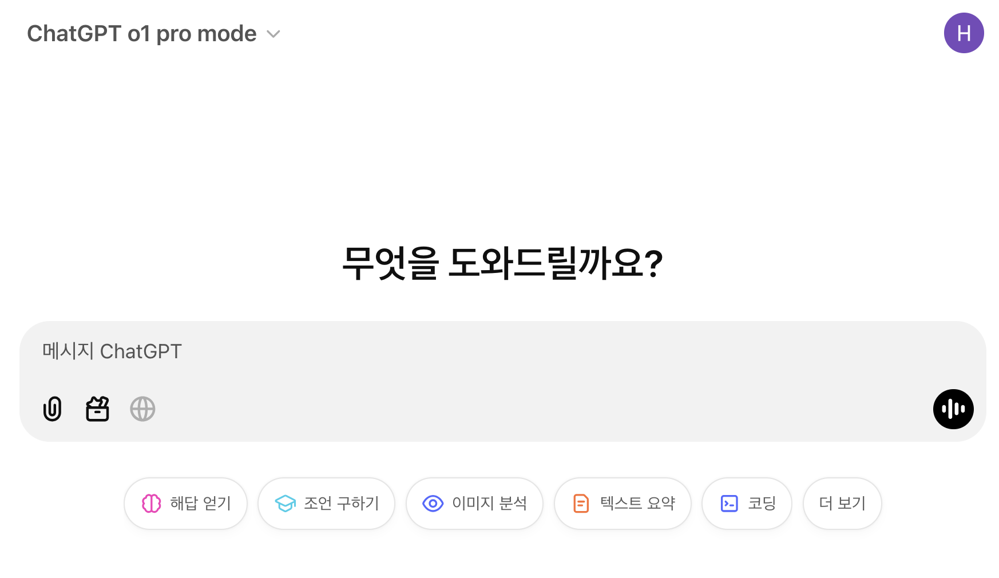
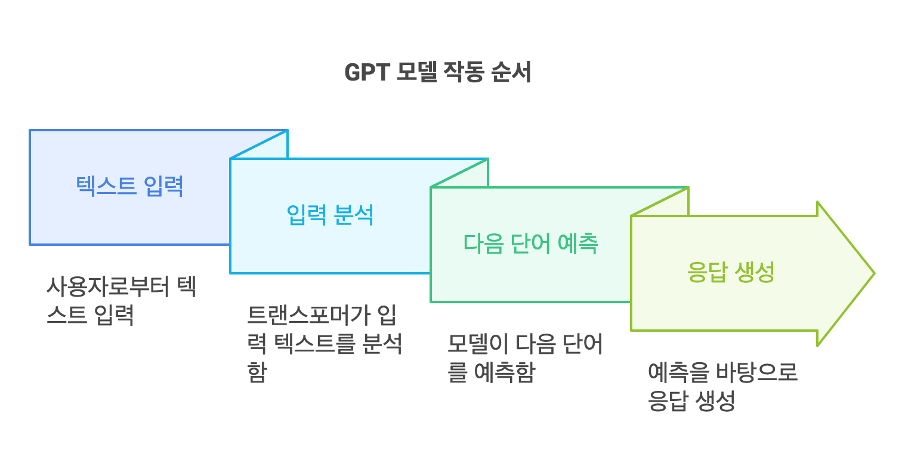
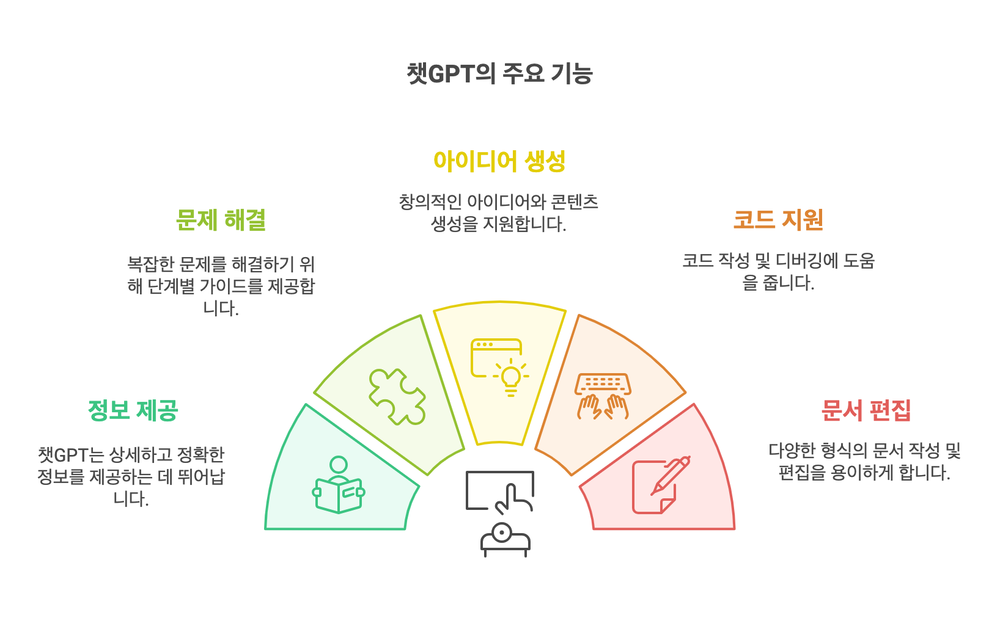
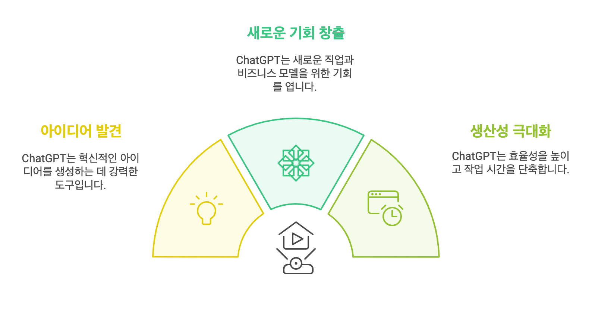
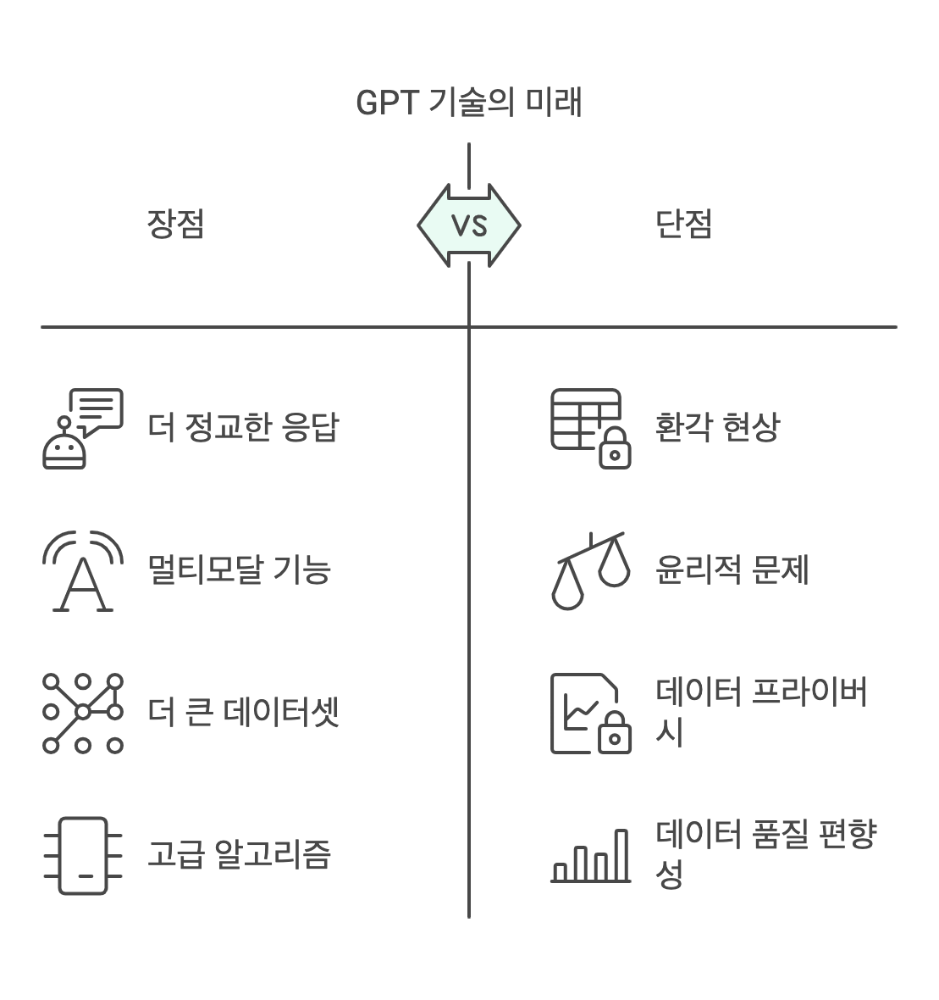

🏠 > 챗GPT 완벽가이드 >
<!-- https://www.magicaiprompts.com/docs/chatgpt/what-is-chatgpt/ -->

---

# 챗GPT (ChatGPT) 란? AI 시대를 이끄는 차세대 기술의 현재와 미래
인공지능(AI)은 현대 기술의 핵심으로 자리 잡고 있으며, 그 중에서도 챗GPT는 AI 기술의 대표적인 사례로 주목받고 있습니다. 챗GPT는 단순한 대화형 AI를 넘어, 다양한 산업과 일상생활에서 혁신적인 변화를 이끌고 있습니다. 이 글에서는 챗GPT의 정의, 작동 원리, 주요 기능, 그리고 미래 전망에 대해 깊이 있게 살펴보겠습니다.

## 챗GPT (ChatGPT) 란 무엇인가?
챗GPT(ChatGPT)는 OpenAI에서 개발한 대화형 인공지능 모델로, 인간과 유사한 대화를 생성할 수 있는 기술입니다. 이 기술은 **GPT(Generative Pre-trained Transformer)**라는 언어 모델을 기반으로 하며, 자연어 처리(NLP) 기술을 활용해 텍스트 데이터를 학습하고 이를 바탕으로 응답을 생성합니다.

|  |
|:---:|
| Fig1. 챗GPT 사용자 인터페이스와 대화 화면 |

### GPT의 정의와 기본 개념
GPT는 "Generative Pre-trained Transformer"의 약자로, 사전 학습된 생성형 변환기를 의미합니다. 이 모델은 대규모 텍스트 데이터를 학습하여 언어의 구조와 패턴을 이해하고, 이를 기반으로 새로운 텍스트를 생성할 수 있습니다. GPT는 기본적으로 인간의 언어를 이해하고 생성하는 데 초점을 맞춘 딥러닝 모델입니다.

### GPT와 챗GPT의 차이점
GPT와 챗GPT의 가장 큰 차이점은 용도와 최적화 방식에 있습니다. GPT는 다양한 텍스트 생성 작업에 활용될 수 있는 범용 모델인 반면, 챗GPT는 대화형 응답 생성에 특화되어 있습니다. 챗GPT는 사용자와의 대화 맥락을 이해하고, 자연스럽고 유의미한 대화를 이어갈 수 있도록 설계되었습니다.

### 챗GPT의 작동 원리
챗GPT는 어떻게 작동할까요? 이 기술의 작동 원리를 이해하면, 챗GPT가 얼마나 강력한 도구인지 알 수 있습니다.

GPT 모델의 구조와 학습 방식
GPT 모델은 **트랜스포머(Transformer)**라는 딥러닝 아키텍처를 기반으로 합니다. 트랜스포머는 입력된 텍스트 데이터를 분석하고, 이를 바탕으로 다음에 올 단어를 예측하는 방식으로 작동합니다. 학습 과정에서는 대규모 텍스트 데이터를 사용하여 언어의 문법, 문맥, 의미를 학습합니다. 이를 통해 GPT는 다양한 주제에 대해 높은 수준의 응답을 생성할 수 있습니다.

|  |
|:---:|
| Fig2. 챗GPT의 GPT 모델 작동 방식을 설명하는 워크플로우 |

자연어 처리(NLP)에서의 GPT의 역할
자연어 처리(NLP)는 컴퓨터가 인간의 언어를 이해하고 생성할 수 있도록 돕는 기술입니다. GPT는 NLP의 핵심 기술로, 텍스트 생성, 번역, 요약, 감정 분석 등 다양한 작업에 활용됩니다. 특히 챗GPT는 대화형 NLP 모델로서, 사용자와의 상호작용을 통해 실시간으로 응답을 생성합니다.

### 챗GPT의 주요 기능과 특징
챗GPT는 단순한 대화형 AI를 넘어, 다양한 기능과 특징을 제공합니다.

챗GPT의 대화 생성 능력
챗GPT는 자연스러운 대화 생성에 특화되어 있습니다. 사용자의 질문에 적절한 답변을 제공하며, 대화의 맥락을 이해하고 이를 바탕으로 응답을 조정할 수 있습니다. 예를 들어, 사용자가 "오늘 날씨는 어때?"라고 물으면, 챗GPT는 "오늘은 맑고 따뜻한 날씨입니다."와 같은 응답을 생성할 수 있습니다.

챗GPT의 주요 기능과 특징
챗GPT는 인공지능 기술을 기반으로 한 대화형 AI 도구로, 자연어 처리 능력을 통해 사용자와 자연스러운 대화가 가능합니다. 특히 텍스트 생성, 코드 작성, 분석, 번역 등 다양한 작업을 수행할 수 있어 개인과 기업 모두에게 유용한 도구로 자리잡았습니다.

|  |
|:---:|
| Fig3. 챗GPT의 주요 기능과 특징을 보여주는 인포그래픽 |

가장 두드러진 특징은 맥락을 이해하고 연속적인 대화를 이어갈 수 있다는 점입니다. 이를 통해 복잡한 주제에 대한 심층적인 토론이 가능하며, 사용자의 요구사항을 정확히 파악하여 맞춤형 답변을 제공합니다. 또한 프로그래밍, 데이터 분석, 창작 활동 등 전문적인 영역에서도 뛰어난 성능을 보여줍니다.

챗GPT는 특히 다음과 같은 영역에서 탁월한 성능을 보입니다:

상세하고 정확한 정보 제공
복잡한 문제 해결을 위한 단계별 가이드
창의적인 아이디어 제안과 콘텐츠 생성
코드 작성 및 디버깅 지원
다양한 형식의 문서 작성과 편집
이러한 기능들은 업무 효율성을 높이고, 학습과 창작 활동을 지원하며, 새로운 아이디어를 발견하는 데 큰 도움이 됩니다. 특히 최근에는 프로젝트 기능이 추가되어 더욱 체계적인 작업 관리가 가능해졌습니다.

### ChatGPT를 잘 써야 하는 3가지 이유
AI 시대의 핵심 도구인 ChatGPT는 단순한 대화형 AI를 넘어 우리의 일상과 업무를 혁신적으로 변화시키고 있습니다. ChatGPT를 반드시 활용해야 하는 주요한 이유를 살펴보겠습니다.

|  |
|:---:|
| Fig4. 챗GPT 사용해야 하는 이유 3가지 |

1. 새로운 아이디어 발견
ChatGPT는 다양한 분야의 혁신적인 아이디어를 제공하는 강력한 브레인스토밍 도구입니다. 마케팅 전략부터 제품 개발, 콘텐츠 기획까지 광범위한 영역에서 참신한 아이디어를 얻을 수 있습니다.

- 창의적인 문제 해결 방안 제시
- 다양한 관점에서의 아이디어 제공
- 새로운 접근 방식과 시각 제안

2. 새로운 기회 창출
AI 기술의 발전으로 프롬프트 엔지니어링과 같은 새로운 직무가 등장하고 있습니다. ChatGPT를 효과적으로 활용하는 능력은 미래 직업 시장에서 중요한 경쟁력이 될 것입니다.

- 프롬프트 엔지니어링 전문가 수요 증가
- AI 기반 비즈니스 모델 개발 기회
- 새로운 직무 분야 개척 가능성

3. 생산성과 효율성 극대화
ChatGPT를 활용하면 업무 처리 시간을 대폭 단축하고 결과물의 품질을 향상시킬 수 있습니다. 반복적인 작업을 자동화하고 복잡한 문제를 효율적으로 해결할 수 있습니다.

- 문서 작성 및 편집 시간 단축
- 코드 작성 및 디버깅 효율화
- 리서치 및 데이터 분석 속도 향상

이러한 이점들을 고려할 때, ChatGPT는 현대 비즈니스 환경에서 필수적인 도구라고 할 수 있습니다. 적극적인 활용을 통해 개인과 조직의 경쟁력을 높일 수 있습니다.

다양한 산업에서의 활용 사례
챗GPT는 다양한 산업에서 활용되고 있습니다. 예를 들어, 고객 서비스에서는 챗봇으로 사용되어 고객 문의를 처리하고, 교육 분야에서는 학습 자료 생성 및 개인 맞춤형 학습 지원에 활용됩니다. 또한, 콘텐츠 제작, 번역, 코드 작성 등에서도 챗GPT의 활용 가능성은 무궁무진합니다.

### 챗GPT의 현재와 미래
챗GPT는 현재 AI 기술의 선두주자로 자리 잡고 있으며, 앞으로도 지속적인 발전이 기대됩니다.

|  |
|:---:|
| Fig5. 챗GPT의 미래 발전 방향과 가능성을 설명하는 다이어그램 |

현재 AI 기술에서 챗GPT의 위치
챗GPT는 현재 AI 기술의 중심에 있으며, 다양한 응용 분야에서 혁신을 이끌고 있습니다. 특히, 챗GPT는 사용자 경험을 개선하고, 생산성을 높이는 데 중요한 역할을 하고 있습니다.

GPT 기술의 발전 가능성과 미래 전망
GPT 기술은 앞으로도 더욱 발전할 가능성이 큽니다. 예를 들어, 더 큰 데이터셋과 고도화된 알고리즘을 통해 더욱 정교한 응답을 생성할 수 있을 것입니다. 또한, 멀티모달 AI 기술과 결합하여 텍스트뿐만 아니라 이미지, 음성 등 다양한 형식의 데이터를 처리할 수 있는 모델로 발전할 가능성도 있습니다.

### 챗GPT를 활용하는 방법
챗GPT를 효과적으로 활용하려면 몇 가지 팁을 참고할 수 있습니다.

챗GPT를 사용하는 실용적인 팁
챗GPT를 사용할 때는 명확하고 구체적인 질문을 제시하는 것이 중요합니다. 예를 들어, "오늘의 뉴스 요약을 알려줘"와 같은 질문은 챗GPT가 더 정확한 응답을 제공할 수 있도록 돕습니다.

챗GPT를 통해 얻을 수 있는 이점
챗GPT를 활용하면 시간과 노력을 절약할 수 있습니다. 예를 들어, 복잡한 문서를 요약하거나, 창의적인 아이디어를 생성하는 데 챗GPT를 활용할 수 있습니다. 또한, 챗GPT는 24시간 언제든지 사용할 수 있어, 사용자에게 높은 접근성을 제공합니다.

챗GPT는 AI 기술의 혁신적인 사례로, 우리의 삶과 업무 방식을 변화시키고 있습니다. 앞으로도 챗GPT와 같은 기술은 더욱 발전하여, 다양한 분야에서 새로운 가능성을 열어줄 것입니다. 챗GPT를 활용하여 더 나은 미래를 만들어보세요!

### 자주 묻는 질문 FAQ
Q1. GPT Chat이란 무엇인가요?
GPT Chat은 GPT 기반의 대화형 인공지능 기술을 의미합니다. GPT 모델이 사용자 질의에 대응하는 텍스트를 생성하여 대화형으로 상호작용하는 형태를 가리키며, 대표적으로 ChatGPT를 들 수 있습니다.

Q2. 챗지피티(ChatGPT)란 무엇인가요?
챗지피티(ChatGPT)는 GPT 언어 모델을 활용한 대화형 AI 챗봇 서비스로, 사용자와 자연스러운 대화를 나누고, 질문에 답하며, 다양한 업무를 지원하는 인공지능입니다.

Q3. GPT 기법이란 무엇인가요?
GPT 기법은 대규모 텍스트 데이터로 사전 학습한 거대 언어 모델(Generative Pre-trained Transformer)을 이용해 텍스트를 생성하는 방식입니다. 트랜스포머 아키텍처와 자기 주의 메커니즘을 활용해 의미와 문맥을 파악하고 새로운 텍스트를 만들어냅니다.

Q4. GPT의 정의는 무엇인가요?
GPT는 "Generative Pre-trained Transformer"의 약자로, 방대한 양의 텍스트 데이터를 사전 학습해 언어 구조를 이해하고 새로운 텍스트를 생성할 수 있는 딥러닝 언어 모델을 의미합니다.

Q5. GPT와 ChatGPT, 그리고 GPTs의 차이는 무엇인가요?
GPT(Generative Pre-trained Transformer), ChatGPT, 그리고 GPTs는 모두 OpenAI의 GPT 기술을 기반으로 하지만, 각각 다른 특징과 활용 방향을 갖습니다.

GPT: 사전 학습된 거대 언어 모델로, 방대한 텍스트 데이터로부터 언어의 구조와 패턴을 이해하고 다양한 자연어 처리 작업(텍스트 생성, 질의응답, 번역, 요약 등)을 수행할 수 있습니다. 대표적인 예로 GPT-3.5, GPT-4 등이 있습니다. 기존에는 AI 모델의 이름으로 사용 되었지만 GPTs 출시 이후에는 각각의 맞춤형 GPT를 나타내는 용어로 사용되기도 합니다.GPT란? GPT 뜻, ChatGPT, GPTs 개념 완벽 정리 바로가기

ChatGPT: GPT 기반 대화형 AI 서비스로, 사용자와 자연스러운 대화를 나누며 질문에 답하고 다양한 작업을 수행합니다. ChatGPT는 작문, 코딩, 번역, 아이디어 제안 등 여러 기능을 제공하며, 일상적인 대화부터 전문적 요청까지 폭넓게 활용할 수 있습니다.

GPTs(맞춤형 AI 챗봇): 특정 도메인이나 작업에 특화된 맞춤형 GPT 모델을 의미합니다. 즉, GPTs는 사용자 요구에 따라 커스터마이징된 GPT 모델로, 특정 분야(예: 마케팅, 연구, 교육)나 목적(예: 카피라이팅, 학술 지원)에 최적화되어 있습니다. 이를 통해 일반적인 대화를 잘하는 ChatGPT와 달리 특정 목적에 맞춘 전문적인 서비스 제공이 가능합니다. 각각의 GPTs를 GPT(맞춤형 GPT)라고 하며 특정 분야나 작업에 특화된 챗GPT로, 사용자의 요구에 따라 맞춤형 서비스를 제공합니다.

요약하자면, GPT는 범용 언어 모델을 의미하고, ChatGPT는 이를 기반으로 한 대화형 AI 서비스이며, GPTs는 특정 목적과 분야에 맞게 맞춤화한 GPT 모델을 가리킵니다.

