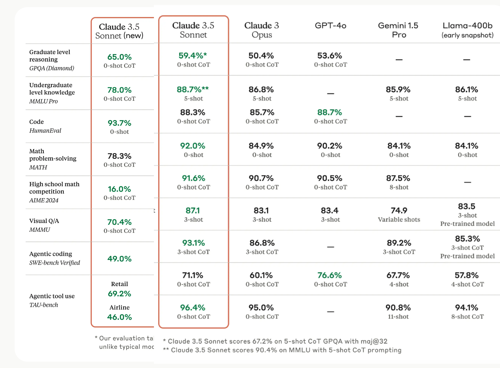
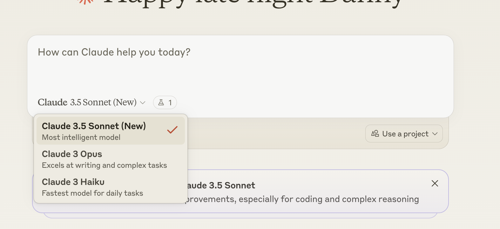

🏠 > [클로드 (Claude)](../) > `Claude 3.5 소넷 (Sonnet) 신규 업그레이드 - 코딩과 추론능력이 강화된 최고 성능의 AI 모델`

### INDEX
- [New Claude 3.5 소넷 (Sonnet) 신규 버전](#new-claude-35-소넷-sonnet-신규-버전)
- [New Claude 3.5 소넷 사용법](#new-claude-35-소넷-사용법)
- [세부 성능 분석](#세부-성능-분석)
- [경쟁 모델과의 비교 우위](#경쟁-모델과의-비교-우위)
- [실무 적용시 장점](#실무-적용시-장점)
- [결론](#결론)
 
---

# Claude 3.5 소넷 (Sonnet) 신규 업그레이드! 
> 코딩과 추론능력이 강화된 최고 성능의 AI 모델

인공지능 기술의 진보는 매일 새로운 이정표를 세우고 있습니다. 그 중심에서 앤트로픽(Anthropic)의 Claude 3.5 소넷이 또 한 번 혁신적인 진화를 이뤄냈습니다. <br/>
이번 업그레이드는 단순한 성능 개선을 넘어, AI의 새로운 가능성을 보여주는 획기적인 진전입니다. <br/>
코딩부터 복잡한 추론까지, 모든 영역에서 놀라운 성능 향상을 보여준 Claude 3.5 소넷의 새로운 모습을 자세히 살펴보겠습니다.

## 클로드 3.5 소넷 이란?
클로드 3.5 소넷은 앤트로픽이 야심차게 선보인 최신 AI 모델입니다. 기존 클로드 3 오푸스(Opus)의 뒤를 잇는 이 모델은 단순한 후속작이 아닌, AI 기술의 새로운 지평을 여는 혁신적인 진보를 보여주고 있습니다.

## New Claude 3.5 소넷 (Sonnet) 신규 버전
클로드 3.5 소넷은 단순한 업그레이드가 아닌, AI의 새로운 지평을 여는 혁신적인 모델입니다. 뛰어난 성능을 기반으로, 코딩 능력과 추론 능력에서 놀라운 발전을 이루어냈습니다. 특히 SWE-bench에서 49.0%라는 경이로운 성과를 달성하며, AI 코딩 분야의 새로운 기준을 제시했습니다.


|  |
|:---:|
| Fig1. Claude 3.5 소넷 vs New Claude 3.5 소넷 비교 |

Claude 3.5 소넷의 새로운 업그레이드는 이전 버전과 비교하여 모든 평가 영역에서 눈에 띄는 성능 향상을 보여주었습니다. 특히 코딩과 추론 능력에서 큰 폭의 개선이 이루어졌습니다.

### 주요 성능 향상 지표

| 평가 영역 | 이전 버전 | 신규 버전 | 성능 향상 |
| -------- |-------- | -------- | -------- |
| 대학원급 추론 (GPQA)            | 59.4% |	65.0% |	+5.6%p |
| 학부생급 지식 (MMLU Pro)        | 75.1% |	78.0% |	+2.9%p |
| 코딩 능력 (HumanEval)          | 92.0% |	93.7% |	+1.7%p |
| 에이전트 코딩 (SWE-bench)       | 33.4% |	49.0% |	+15.6%p |
| 도구 활용 - 리테일 (TAU-bench)  | 62.6% |	69.2% |	+6.6%p  |
| 도구 활용 - 항공 (TAU-bench)    | 36.0% |	46.0% |	+10.0%p |

<br/>

[[TOP]](#index)

---
## New Claude 3.5 소넷 사용법
새롭게 출시된 클로드 3.5 소넷은 아래 화면에서 볼수 있듯이 바로 사용할 수 있습니다.

|  |
|:---:|
| Fig2. New Claude 3.5 소넷 |

<br/>

[[TOP]](#index)

---
## 세부 성능 분석

### 1. 추론 능력의 획기적 향상
  - 대학원급 추론: 59.4%에서 65.0%로 5.6%p 상승
  - 학부생급 지식: 75.1%에서 78.0%로 2.9%p 향상
  - 텍스트 기반 추론: 더 복잡한 문제 해결 능력 강화

### 2. 코딩 역량의 탁월한 발전
```
코딩 성능 향상 비교
─────────────────────────────────────────
HumanEval        │▲ 92.0% → 93.7% (+1.7%p)
SWE-bench        │▲ 33.4% → 49.0% (+15.6%p)
─────────────────────────────────────────
```

특히 주목할 만한 점:
  - 기본 코딩 능력(HumanEval)에서 이미 높았던 성능을 더욱 개선
  - 실제 개발 환경에서의 코딩 능력(SWE-bench)이 크게 향상

### 3. 도구 활용 능력의 비약적 발전

리테일 분야:
  - 이전: 62.6%
  - 현재: 69.2%
  - 향상: +6.6%p

항공 분야:
  - 이전: 36.0%
  - 현재: 46.0%
  - 향상: +10.0%p

### 4. 수학 및 시각적 이해력 개선
  - 수학 문제 해결력: 71.1%에서 78.3%로 향상
  - 시각적 Q&A: 68.3%에서 70.4%로 개선

<br/>

[[TOP]](#index)

---
## 경쟁 모델과의 비교 우위
Claude 3.5 소넷은 다음 영역에서 타 모델들을 크게 앞서고 있습니다:

특성	Claude 3.5 Sonnet	비교
코딩 성능	93.7%	- GPT-4 (90.2%) 대비 우위
- Gemini 1.5 Pro보다 더 나은 성능
추론 능력	65.0%	- GPT-4 (53.6%) 대비 월등한 성능
- 모든 경쟁 모델 중 최고 성능
도구 활용	높은 성능	- 유일하게 복잡한 도구 활용 태스크에서 높은 성능
- 실제 비즈니스 환경에서의 활용도 극대화
이 표는 Claude 3.5 Sonnet의 주요 특성과 경쟁 모델과의 비교를 간결하게 보여줍니다. 코딩 성능, 추론 능력, 도구 활용 측면에서 Claude 3.5 Sonnet의 우수성을 강조하고 있습니다.

<br/>

[[TOP]](#index)

---
## 실무 적용시 장점
개발 생산성 향상

더 정확한 코드 생성
복잡한 개발 문제 해결 능력 강화
비즈니스 프로세스 최적화

더 나은 도구 활용 능력
복잡한 업무 자동화 가능
의사결정 지원

향상된 추론 능력으로 더 나은 분석 제공
복잡한 문제에 대한 더 깊은 이해

<br/>

[[TOP]](#index)

---
## 결론
신규 업그레이드된 Claude 3.5 소넷은 이전 버전 대비 모든 영역에서 상당한 성능 향상을 보여주었습니다. 특히 코딩과 추론 능력에서의 큰 폭 향상은 실제 업무 환경에서 더 높은 생산성과 정확성을 제공할 것으로 기대됩니다. 이러한 성능 향상은 Claude 3.5 소넷이 현재 시장에서 가장 강력한 AI 모델 중 하나임을 보여줍니다.

더 자세한 내용과 최신 업데이트는 앤트로픽 공식 블로그에서 확인하실 수 있습니다.

<br/>

[[TOP]](#index)

---