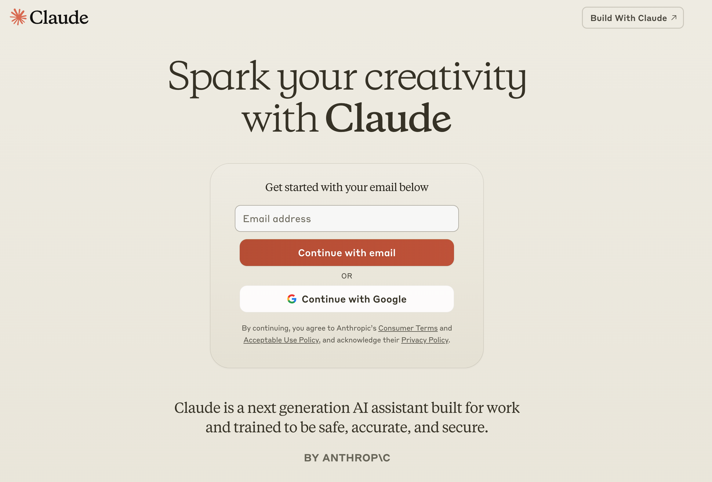
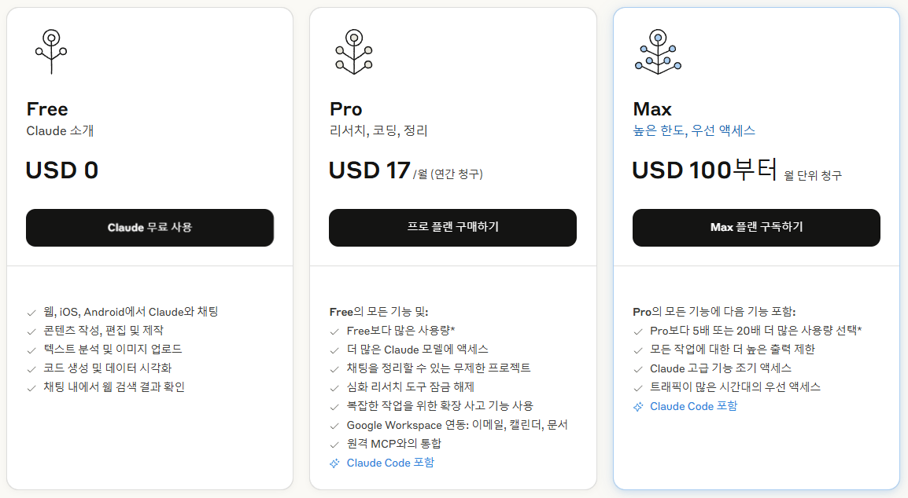
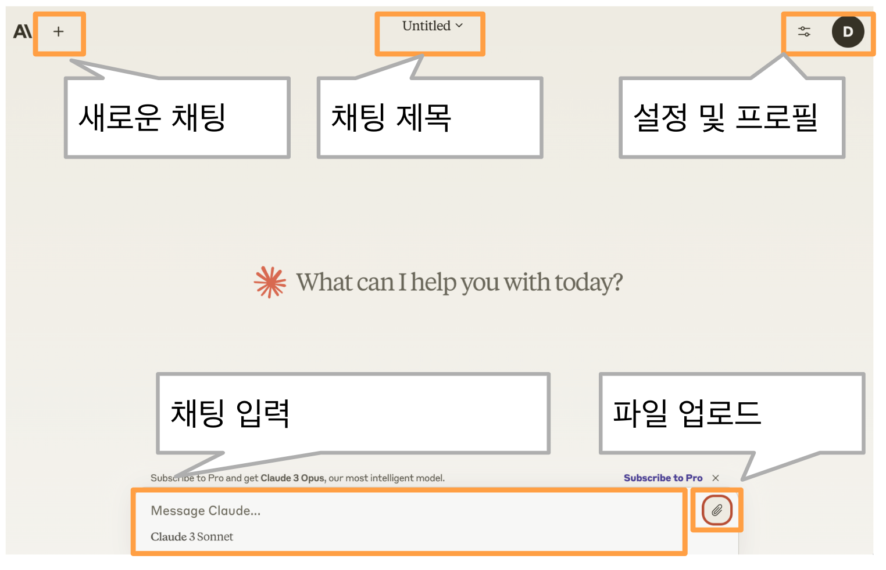

🏠 > 클로드 (Claude) >
<!-- https://www.magicaiprompts.com/docs/claude/ -->

### INDEX

---
# 클로드 (Claude) AI 총정리 | 가장 강력한 글쓰기와 코딩 능력
인공지능(AI)은 우리의 일상과 업무 방식을 혁신적으로 변화시키고 있습니다. 그 중에서도 클로드 AI는 뛰어난 글쓰기와 코딩 능력으로 주목받고 있는 AI 모델입니다. 이 글에서는 클로드 AI의 정의, 사용법, 주요 기능, 그리고 ChatGPT와의 차이점까지 상세히 알아보겠습니다. 클로드 AI를 활용해 생산성을 극대화하고 싶다면 끝까지 읽어보세요!

## 클로드 (Claude) AI 란?
클로드 (Claude) AI는 **Anthropic** 이라는 AI 연구 회사에서 개발한 대규모 언어 모델(LLM)입니다. 이 모델은 OpenAI의 ChatGPT와 유사한 기능을 제공하지만, 안전성과 윤리성을 강조하며 설계되었습니다. 클로드 AI는 특히 글쓰기, 코딩, 데이터 분석 등 다양한 작업에서 뛰어난 성능을 발휘합니다.

|  |
|:---:|
| Fig1. 클로드(Claude) AI |

Anthropic은 OpenAI의 출신 직원들이 설립한 회사로, AI의 안전성과 윤리적 사용을 최우선으로 고려합니다. 클로드 AI는 이러한 철학을 바탕으로 개발되었으며, 2023년 Claude 2, 2024년 Claude 3와 Claude 3.5 Sonnet, Haiku 모델을 출시하며 지속적으로 발전하고 있습니다.

|  |
|:---:|
| Fig2. 클로드(Claude) 서비스 요금제 |

[[지금 무료로 시작하기]](https://claude.ai/onboarding)

 

[[TOP]](#index)

---
## 클로드 AI vs 챗GPT 차이점
클로드 AI와 ChatGPT는 모두 대화형 AI 모델이지만, 몇 가지 중요한 차이점이 있습니다.

<table>
    <thead>
        <tr>
            <th><strong>특징</strong></th>
            <th><strong>클로드 AI</strong></th>
            <th><strong>ChatGPT</strong></th>
        </tr>
    </thead>
    <tbody>
        <tr>
            <td><strong>장점</strong></td>
            <td>뛰어난 글쓰기와 코딩 능력</td>
            <td>멀티모달 (GPT4o) 지원 및 추론 능력 (o1)</td>
        </tr>
        <tr>
            <td><strong>컨텍스트 창 크기</strong></td>
            <td>최대 200K 컨텍스트 창 지원</td>
            <td>최대 128K 컨텍스트 창 지원</td>
        </tr>
        <tr>
            <td><strong>맞춤형 기능</strong></td>
            <td>Claude Projects로 맞춤형 챗봇 제작 가능</td>
            <td>GPTs로 맞춤형 챗봇 제작 가능</td>
        </tr>
        <tr>
            <td><strong>데이터 분석 기능</strong></td>
            <td>내장된 분석 도구로 데이터 처리 가능</td>
            <td>Python 코드 실행을 통한 데이터 처리</td>
        </tr>
    </tbody>
</table>

 

[[TOP]](#index)

---
## 클로드 AI 사용법

클로드 AI를 사용하려면 먼저 Claude.ai 웹사이트에 접속해 계정을 생성해야 합니다. 가입 과정은 간단하며, 전화번호 인증을 통해 계정을 활성화할 수 있습니다. 이후 로그인하면 직관적인 인터페이스를 통해 클로드 AI와 대화를 시작할 수 있습니다.

|  |
|:---:|
| Fig3. Claude 사용법 첫화면 |

### 클로드 AI의 주요 기능 활용법
클로드 AI는 다음과 같은 주요 기능을 제공합니다:

<ol>
  <li> <b>글쓰기 지원</b> : 블로그, 소설, 이메일 등 다양한 글쓰기 작업을 지원합니다.
  <li> 코딩 지원: 코드 작성, 디버깅, 코드 리뷰 등 프로그래밍 작업을 돕습니다.
  <li>데이터 분석: CSV 파일 업로드 후 데이터 분석 및 시각화를 제공합니다.
  <li>맞춤형 설정: Custom Instructions를 통해 AI의 응답 스타일과 행동 방식을 조정할 수 있습니다.
</ol>

 

[[TOP]](#index)

---
## 클로드 프로젝트(Claude Projects) 맞춤형 챗봇 만들기
클로드 프로젝트 (Claude Projects) 는 사용자가 맞춤형 AI 챗봇을 제작할 수 있도록 지원하는 기능입니다. 이 기능은 OpenAI의 GPTs와 유사하지만, 클로드 AI의 강력한 성능을 기반으로 더욱 세밀한 커스터마이징이 가능합니다.

클로드 프로젝트

주요 특징
맞춤형 지식 기반 구축: 프로젝트에 필요한 문서와 데이터를 업로드해 AI가 학습하도록 설정할 수 있습니다.
Custom Instructions: AI의 응답 스타일과 행동 방식을 세밀하게 조정할 수 있습니다.
팀 협업 지원: 프로젝트를 팀원들과 공유해 협업 효율성을 높일 수 있습니다.
클로드 AI로 맞춤형 챗봇 제작하기
클로드 프로젝트는 사용자가 맞춤형 챗봇을 제작할 수 있는 기능을 제공합니다. Custom Instructions를 통해 챗봇의 역할, 응답 스타일, 지식 기반 등을 설정할 수 있습니다.

클로드 프로젝트의 활용 사례
클로드 프로젝트는 다양한 분야에서 활용될 수 있습니다. 예를 들어, 고객 서비스 팀은 클로드 프로젝트를 활용해 지능형 FAQ 챗봇을 제작하고, 마케팅 팀은 데이터 기반의 캠페인 전략을 수립할 수 있습니다.

나만의 맞춤형 AI 어시스턴트를 만들어보세요
프로젝트 만들기
클로드 아티팩트 (Claude Artifacts)
**클로드 아티팩트 (Claude Artifacts)**는 클로드 AI가 생성한 콘텐츠를 별도의 창에 표시해주는 기능입니다. 이를 통해 사용자는 실시간으로 생성된 콘텐츠를 확인하고 수정할 수 있습니다. 예를 들어, 코드 스니펫, 텍스트 문서, 웹사이트 디자인 등을 아티펙트로 생성할 수 있습니다.

클로드 아티펙트를 활용하면 다음과 같은 작업이 가능합니다:

코드 작성 및 수정: 클로드 AI가 작성한 코드를 실시간으로 확인하고 수정할 수 있습니다.
디자인 검토: 생성된 디자인을 미리보기 창에서 바로 확인할 수 있습니다.
버전 관리: 아티펙트의 이전 버전을 저장하고 필요할 때 복원할 수 있습니다.
이 기능은 특히 개발자와 디자이너에게 유용하며, 프로젝트 관리와 협업 효율성을 크게 향상시킵니다.

당신의 아이디어가 실시간으로 완성되는 마법을 경험하세요
창작 시작하기
클로드 분석 도구 (Analysis Tool)
클로드에서는 데이터 분석을 도와주는 클로드 분석 도구 (Analysis Tool) 기능을 제공합니다. 이를 통해 사용자는 데이터를 업로드하고, 자연어로 분석 요청을 하면 클로드가 데이터를 처리하고 인사이트를 제공합니다.

클로드 AI의 데이터 분석 기능
클로드 AI의 분석 도구는 데이터를 빠르고 정확하게 처리할 수 있는 강력한 기능을 제공합니다. 사용자는 CSV 파일을 업로드하고, 자연어로 분석 요청을 하면 클로드가 데이터를 처리하고 인사이트를 제공합니다.

클로드 AI를 활용한 효율적인 데이터 처리
예를 들어, "월별 매출 데이터를 분석하고 성장률이 가장 높은 달을 찾아줘"라는 요청을 하면 클로드 AI는 데이터를 분석하고 결과를 시각화하여 제공합니다. 이를 통해 복잡한 데이터 분석 작업을 간단히 수행할 수 있습니다.

복잡한 데이터 분석, 이제 대화만으로 해결하세요
데이터 업로드하기
클로드 컴퓨터 사용 (Claude Computer Use)
데이터 분석 뿐만 아니라 자동화 기능을 제공 하는데요, 클로드 컴퓨터 사용 (Claude Computer Use)로 컴퓨터를 사용하는 기능을 제공합니다. 이를 통해 AI가 실제 컴퓨터를 조작할 수 있도록 지원합니다. 이를 통해 소프트웨어 개발, 데이터 입력, 문서 작성 등 다양한 작업을 자동화할 수 있습니다.

클로드 AI의 코딩 및 프로그래밍 지원 기능
클로드 컴퓨터 사용 기능은 AI가 실제 컴퓨터를 조작할 수 있도록 지원합니다. 이를 통해 소프트웨어 개발, 데이터 입력, 문서 작성 등 다양한 작업을 자동화할 수 있습니다.

클로드 AI를 활용한 생산성 향상 팁
클로드 AI를 활용하면 반복적인 작업을 자동화하고, 복잡한 프로세스를 간소화할 수 있습니다. 예를 들어, 클로드 AI를 사용해 대량의 데이터를 처리하거나, 소프트웨어 테스트를 자동화할 수 있습니다.

결론
AI와 함께하는 미래를 경험할 준비가 되셨나요? 클로드 AI는 뛰어난 글쓰기와 코딩 능력, 데이터 분석 기능, 맞춤형 설정 등 다양한 강점을 가진 AI 모델입니다. 이를 활용하면 생산성을 극대화하고, 복잡한 작업을 간단히 해결할 수 있습니다. 지금 바로 클로드 AI를 사용해보세요!

