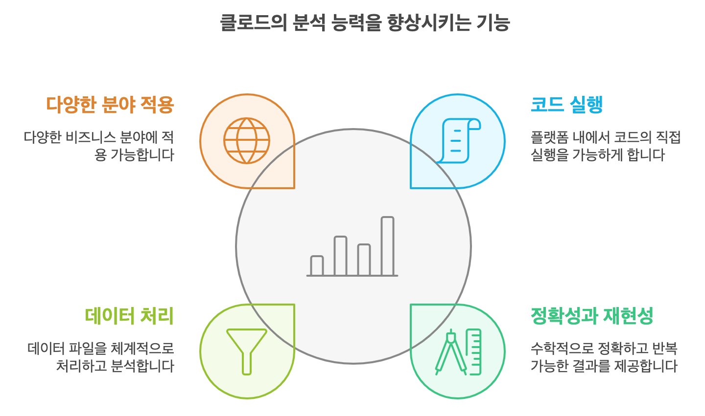
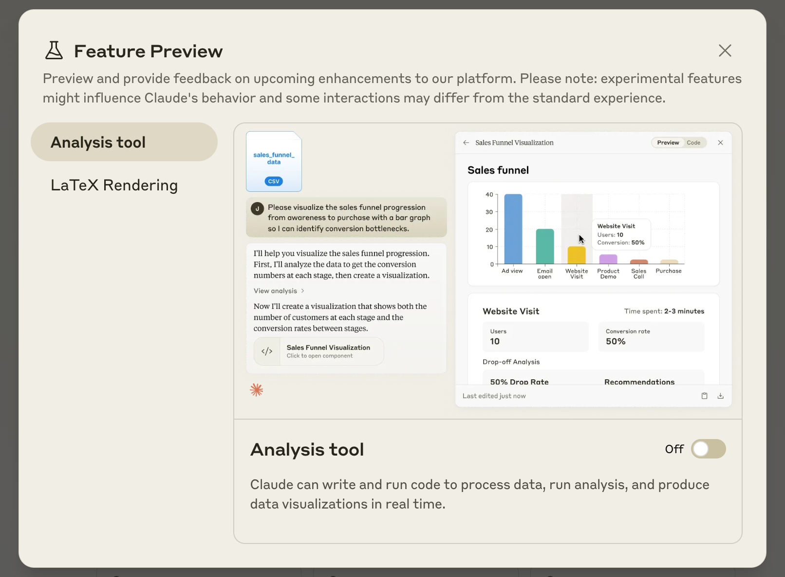
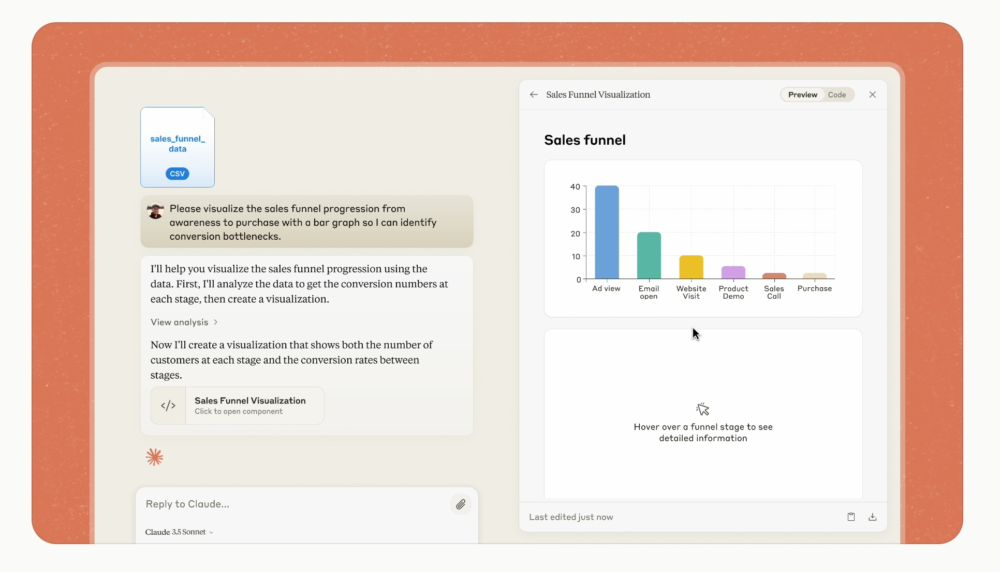
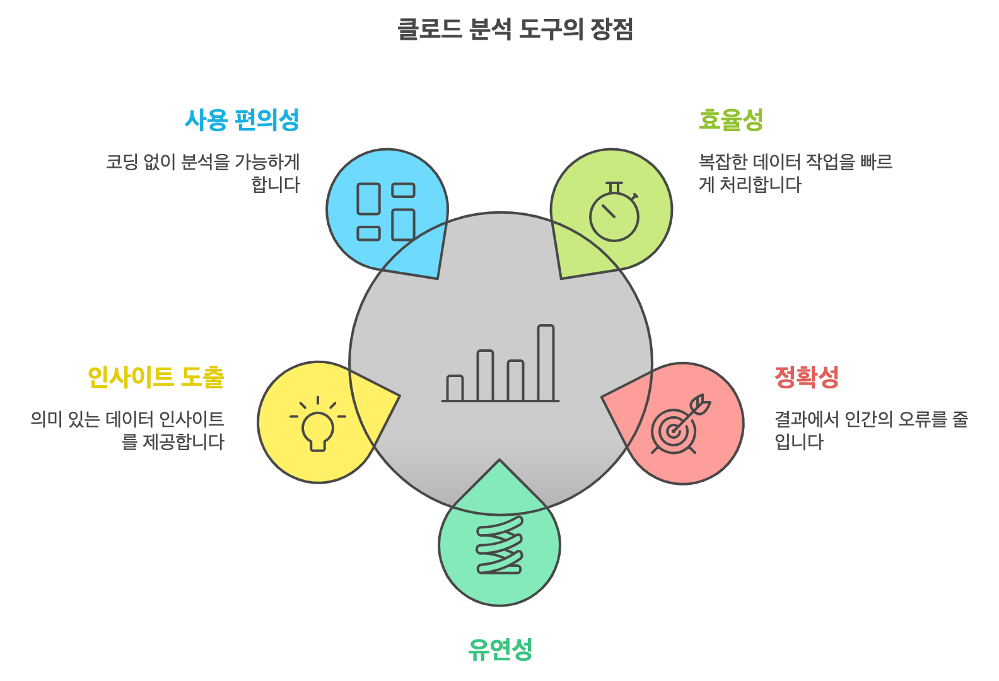

🏠 > [클로드 (Claude)](./) > `클로드 분석 도구 (Analysis Tool) 사용법 - 클로드 AI 데이터 분석, AI기반 인사이트 추출`
<!-- https://www.magicaiprompts.com/docs/claude/ -->

### INDEX

- [클로드 분석 도구 (Analysis Tool) 사용법](#클로드-분석-도구-analysis-tool-사용법)
- [클로드 분석 도구 (Claude Analysis Tool) 란?](#클로드-분석-도구-claude-analysis-tool-란)
- [클로드 분석 도구 주요 특징](#클로드-분석-도구-주요-특징)
- [클로드 분석 도구 (Claude Analysis Tool) 사용법](#클로드-분석-도구-claude-analysis-tool-사용법)
- [클로드 분석 도구 장점](#클로드-분석-도구-장점)
- [클로드 분석 도구의 활용 사례](#클로드-분석-도구의-활용-사례)
- [결론](#결론)

---
# 클로드 분석 도구 (Analysis Tool) 사용법 
> 클로드 AI 데이터 분석, AI기반 인사이트 추출

데이터 분석과 인사이트 도출은 현대 비즈니스에서 필수적인 요소입니다. 하지만 복잡한 데이터를 다루는 것은 쉽지 않은 일이죠.  
이런 상황에서 AI의 도움을 받는다면 어떨까요? 클로드(Claude)의 새로운 분석 도구는 바로 이런 고민을 해결해줄 수 있는 강력한 솔루션입니다. 이 글에서는 클로드 분석 도구의 특징과 사용법에 대해 자세히 알아보겠습니다.

## 클로드 분석 도구 (Claude Analysis Tool) 란?
클로드 분석 도구 (Claude Analysis Tool) 는 Anthropic에서 개발한 Claude.ai의 새로운 내장 기능입니다. 이 도구를 통해 Claude는 JavaScript 코드를 작성하고 실행할 수 있게 되었습니다. 즉, 데이터 처리, 분석 수행, 실시간 인사이트 도출 등이 가능해진 것이죠.

이 도구는 일종의 내장형 코드 샌드박스로 작동합니다. Claude는 이를 통해 복잡한 수학 계산을 수행하고, 데이터를 분석하며, 다양한 아이디어를 반복 실험할 수 있습니다. 그 결과를 바탕으로 더욱 정확하고 신뢰할 수 있는 답변을 제공합니다.

 

[[TOP]](#index)

---
## 클로드 분석 도구 주요 특징
클로드 분석 도구는 아래와 같은 특징을 가지고 있습니다. 

|  |
|:---:|
| Fig1. 클로드 분석 도구 특징 |

- **코드 실행 기능:** Claude는 이제 단순히 코드를 작성하는 것을 넘어 Claude.ai 내에서 직접 코드를 실행할 수 있습니다. 이는 다양한 분석 작업을 지원합니다.

- **정확성과 재현성:** 분석 도구를 통해 Claude는 단순히 잘 추론된 답변이 아닌, 수학적으로 정확하고 재현 가능한 결과를 제공합니다.

- **데이터 처리 능력:** CSV 파일 등의 데이터를 체계적으로 처리할 수 있습니다. 데이터 정제, 탐색, 분석 등의 과정을 단계별로 수행합니다.

- **다양한 분야 적용:** 마케팅, 영업, 제품 관리, 엔지니어링, 재무 등 다양한 분야에서 활용 가능합니다.

 

[[TOP]](#index)

---
## 클로드 분석 도구 (Claude Analysis Tool) 사용법
클로드 분석 도구를 사용하기 위한 단계별 가이드를 소개합니다:

### 1. 기능 활성화:
  - [Claude.ai](https://claude.ai/) 에 로그인합니다.
  - 화면 좌측 하단의 사용자 이름을 클릭합니다.
  - `Feature Previews` 섹션에서 분석 도구를 활성화합니다.

|  |
|:---:|
| Fig2. 클로드 분석 도구 미리보기 |

### 2. 데이터 업로드:
  - 분석하고자 하는 데이터를 CSV 형식으로 준비합니다.
  - Claude와의 대화 창에 CSV 파일을 드래그 앤 드롭하거나 업로드 버튼을 통해 첨부합니다.

### 3. 분석 요청:
  - 업로드한 데이터에 대해 원하는 분석 내용을 자연어로 요청합니다.
  - 예: "이 CSV 파일의 월별 매출 추이를 분석해주고, 성장률이 가장 높은 달을 찾아줘."

|  |
|:---:|
| Fig3. 클로드 분석 도구 예시 |

### 4. 결과 확인 및 추가 질문:
  - Claude가 제공하는 분석 결과를 확인합니다.
  - 필요한 경우 추가적인 질문이나 분석 요청을 할 수 있습니다.

### 5. 시각화 요청:
  - 데이터 시각화가 필요한 경우, Claude에게 그래프나 차트 생성을 요청할 수 있습니다.
  - 예: "이 데이터를 막대 그래프로 표현해줘."

 

[[TOP]](#index)

---
## 클로드 분석 도구 장점
클로드 분석 도구는 아래와 같은 이점을 가지고 있습니다.

|  |
|:---:|
| Fig4. 클로드 분석 도구 장점 | 

- **효율성:** 복잡한 데이터 분석 작업을 AI의 도움으로 빠르게 수행할 수 있습니다.

- **정확성:** 인간의 실수 가능성을 줄이고, 수학적으로 정확한 결과를 얻을 수 있습니다.

- **유연성:** 다양한 비즈니스 분야와 데이터 유형에 적용 가능합니다.

- **인사이트 도출:** 단순한 데이터 처리를 넘어 의미 있는 인사이트를 제공합니다.

- **사용 편의성:** 복잡한 프로그래밍 지식 없이도 고급 데이터 분석이 가능합니다.

 

[[TOP]](#index)

---
## 클로드 분석 도구의 활용 사례
클로드 분석 도구는 다양한 비즈니스 상황에서 유용하게 활용될 수 있습니다. 몇 가지 구체적인 사례를 살펴보겠습니다:

- **마케팅팀:**
  - 고객 상호작용 데이터를 업로드하면 Claude가 전환율 개선 기회를 도출합니다.
  - 퍼널 전반의 고객 행동을 분석하여 마케팅 전략 최적화에 도움을 줍니다.

- **영업팀:**
  - 글로벌 영업 데이터를 분석하여 국가별 성과 분석을 제공합니다.
  - 지역별 판매 트렌드를 파악하고 타겟 시장 전략 수립에 활용할 수 있습니다.

- **제품관리자:**
  - 고객 참여 데이터를 기반으로 스프린트 계획 및 개발 우선순위 결정을 지원합니다.
  - 사용자 피드백과 행동 패턴을 분석하여 제품 개선 방향을 제시합니다.

- **엔지니어링팀:**
  - 다양한 서버의 성능 로그를 분석하여 리소스 활용도 개선 영역을 식별합니다.
  - 시스템 병목 현상을 파악하고 최적화 방안을 제안합니다.

- **재무팀:**
  - 월별 재무 데이터를 업로드하면 Claude가 주요 트렌드를 보여주는 재무 대시보드를 생성합니다.
  - 비용 구조 분석, 수익성 예측 등 재무 의사결정을 위한 인사이트를 제공합니다.

 

[[TOP]](#index)

---
## 결론
클로드 분석 도구는 AI 기술을 활용한 데이터 분석의 새로운 지평을 열고 있습니다. 이 도구를 통해 기업은 더욱 빠르고 정확한 의사결정을 내릴 수 있으며, 데이터에 숨겨진 가치 있는 인사이트를 발견할 수 있습니다.  

비즈니스 환경이 점점 더 데이터 중심으로 변화하는 지금, 클로드 분석 도구는 기업의 경쟁력 강화를 위한 필수적인 도구가 될 것입니다. 여러분의 비즈니스에서도 클로드 분석 도구를 활용해 보시는 건 어떨까요? 데이터의 바다에서 숨겨진 보물을 발견하는 여정을 시작해보세요.

**[참고 자료]**
- [Introducing the analysis tool in Claude.ai \ Anthropic](https://www.anthropic.com/news/analysis-tool)

 

[[TOP]](#index)

---