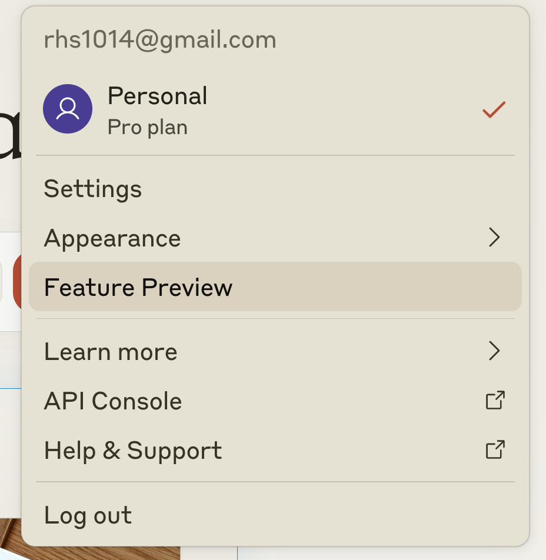
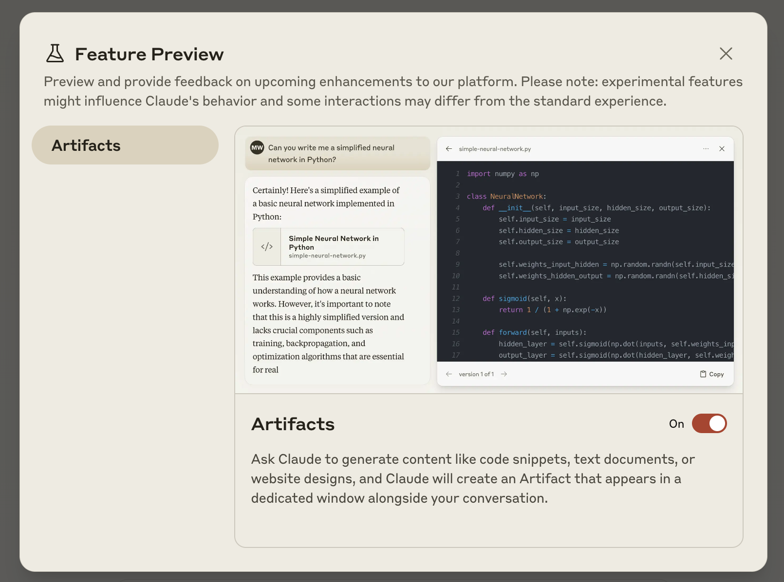
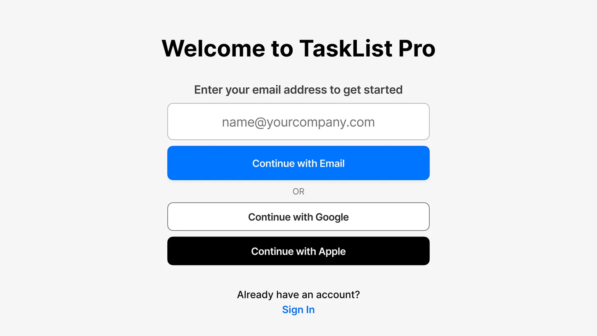
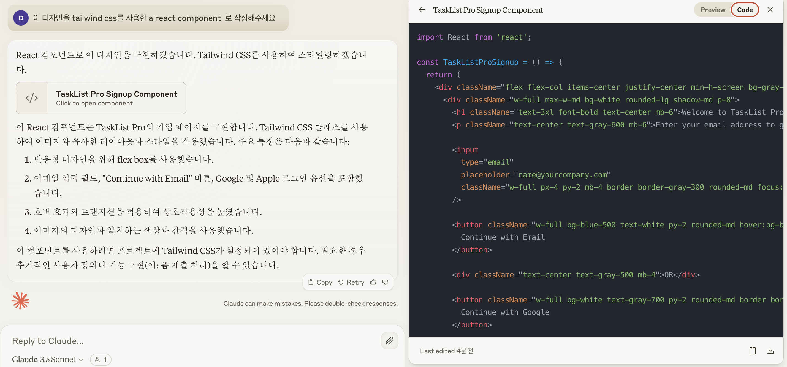
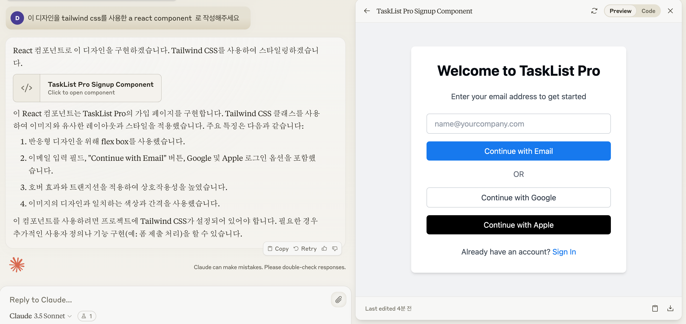
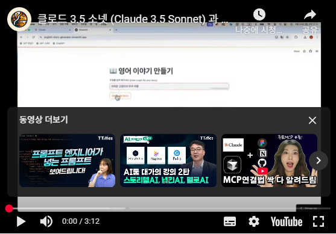

🏠 > [클로드 (Claude)](./) > `클로드 아티팩트 (Claude Artifacts) 사용법 - 클로드의 혁신적인 AI 협업 도구`
<!-- https://www.magicaiprompts.com/docs/claude/ -->

### INDEX

- [클로드 아티팩트 (Claude Artifacts) 란?](#클로드-아티팩트-claude-artifacts-란)
- [클로드 아티팩트 활성화 방법](#클로드-아티팩트-활성화-방법)
- [클로드 아티팩트 사용 예시: 간단한 웹페이지 코드 작성](#클로드-아티팩트-사용-예시-간단한-웹페이지-코드-작성)
- [클로드 아티팩트 활용 팁](#클로드-아티팩트-활용-팁)
- [클로드 아티펙트 (Claude Artifects) 를 활용해서 3분만에 영어 이야기 생성기 AI 웹서비스 만들기](#클로드-아티펙트-claude-artifects-를-활용해서-3분만에-영어-이야기-생성기-ai-웹서비스-만들기)
- [결론](#결론)

---
# 클로드 아티팩트 (Claude Artifacts) 사용법 - 클로드의 혁신적인 AI 협업 도구
클로드 아티팩트(Claude Artifacts)는 Anthropic이 최근 출시한 혁신적인 AI 협업 도구입니다. 이 기능은 Claude AI를 단순한 대화형 AI에서 실시간 협업이 가능한 작업 환경으로 발전시켰습니다. 이 글에서는 클로드 아티팩트의 개념과 활용법, 그리고 이 기능이 가져올 AI 협업의 미래에 대해 자세히 알아보겠습니다.

## 클로드 아티팩트 (Claude Artifacts) 란?
클로드 아티팩트 (Claude Artifacts) 는 Claude AI가 생성한 콘텐츠를 별도의 창에 표시하여 사용자가 실시간으로 확인하고 수정할 수 있게 해주는 기능입니다. 코드 스니펫, 텍스트 문서, 웹사이트 디자인 등 다양한 유형의 콘텐츠를 아티팩트로 생성할 수 있어 프로젝트 작업 흐름을 크게 개선할 수 있습니다.

 

[[TOP]](#index)

---
## 클로드 아티팩트 활성화 방법
아티팩트 기능을 사용하려면 먼저 활성화해야 합니다. 방법은 다음과 같습니다:

 1️⃣ Claude 계정에 로그인합니다.
 2️⃣ 우측 상단의 프로필 을 클릭하고, "Feature preview" 버튼을 클릭합니다.

|  |
|:---:|
| Fig1. 클로드 Feature preview |

 3️⃣ Artifacts 옵션을 ON으로 전환합니다.
|  |
|:---:|
| Fig2. 클로드 아티팩트 옵션 |

클로드 아티팩트 (Claude Artifacts) 옵션 이 과정을 거치지 않으면 아티팩트 기능을 사용할 수 없으니 주의하세요.

 

[[TOP]](#index)

---
## 클로드 아티팩트 사용 예시: 간단한 웹페이지 코드 작성
클로드 아티팩트의 실제 활용 사례를 통해 그 유용성을 살펴보겠습니다. 디자인 이미지를 가지고 간단한 웹페이지 코드를 작성 하는 과정을 예로 들어보겠습니다.

### 1) 먼저 Claude에게 웹피이지 코드 생성을 요청합니다.
아래 이미지를 첨부 하고 다음과 같은 프롬프트로 요청합니다.

|  |
|:---:|
| Fig3. 클로드 아티팩트 (Claude Artifacts) 요청 이미지 예시 |

코드 작성 요청 프롬프트
이 디자인을 tailwind css를 사용한 a react component  로 작성해주세요

### 2) Claude가 생성한 코드가 아티팩트 창에 표시됩니다.

|  |
|:---:|
| Fig4. 클로드 아티팩트 (Claude Artifacts) 코드 작성 예시 |

### 3) 코드 뿐만 아니라 Preview 탭을 통해 디자인을 바로 확인할 수 있습니다.

|  |
|:---:|
| Fig5. 클로드 아티팩트 (Claude Artifacts) 디자인 Preview 예시 |

### 4) 생성된 모든 파일은 "Chat controls" 패널에서 체계적으로 관리됩니다.
이처럼 클로드 아티팩트를 활용하면 코드 작성부터 프로젝트 관리까지 AI와의 효율적인 협업이 가능해집니다.

 

[[TOP]](#index)

---
## 클로드 아티팩트 활용 팁
아티팩트를 더욱 효과적으로 사용하기 위한 몇 가지 팁을 소개합니다:  

❶ **콘텐츠 수정 및 반복:** Claude에게 아티팩트 내용을 수정하거나 발전시켜달라고 요청할 수 있습니다. 변경 사항은 아티팩트 창에 실시간으로 반영됩니다.  

❷ **버전 관리:** Claude는 사용자의 요청에 따라 기존 아티팩트를 업데이트할 수 있습니다. 아티팩트 창 좌측 하단의 버전 선택기를 통해 각 버전을 확인할 수 있습니다.  

❸ **다중 아티팩트 관리:** 하나의 대화에서 여러 아티팩트를 열고 볼 수 있습니다. 우측 상단의 슬라이더 아이콘을 클릭하여 원하는 아티팩트를 선택하고 작업을 이어갈 수 있습니다.  

❹ **외부 활용:** 아티팩트의 코드를 확인하거나 클립보드에 복사하고, 파일로 다운로드하여 외부에서 사용할 수 있습니다. 이 옵션들은 아티팩트 창 우측 하단에 위치해 있습니다.

 

[[TOP]](#index)

---
## 클로드 아티펙트 (Claude Artifects) 를 활용해서 3분만에 영어 이야기 생성기 AI 웹서비스 만들기
Anthropic의 최신 AI 모델인 클로드 3.5 소넷과 함께 출시된 아티펙트 기능을 이용해 3분 만에 AI 웹서비스를 만드는 방법을 알아보겠습니다. 아래 Youtube 영상은 아티펙트 기능을 이용해 3분 만에 영어 이야기 생성기 AI 웹서비스를 만드는 방법을 보여줍니다.

|  |
|:---:|
| Fig6. 클로드 아티펙트 (Artifects)로 3분만에 AI 웹서비스 만들기 |
| (마이크가 없어 소리가 잘 안들리는 점 미리 양해 부탁 드립니다.) |

 

[[TOP]](#index)

---
## 결론
클로드 아티팩트는 AI와의 협업 방식을 획기적으로 변화시킬 잠재력을 가진 혁신적인 기능입니다. 코드 작성, 문서 작업, 디자인 등 다양한 분야에서 AI의 지원을 받아 생산성을 크게 향상시킬 수 있습니다. 앞으로 Anthropic이 이 기능을 어떻게 발전시켜 나갈지, 그리고 이를 통해 AI 협업의 미래가 어떻게 그려질지 기대됩니다.

클로드 아티팩트를 직접 사용해보고 여러분만의 창의적인 활용법을 발견해보세요. AI와의 협업이 가져올 무한한 가능성을 경험하실 수 있을 것입니다.

### 제가 만든 GPT는 당신이 만든 GPT와 전혀 다릅니다
모델 성능은 클로드 3.5 소넷 출시 이후로 클로드가 가장 뛰어나지만 챗GPT의 강력한 차별화 요소가 있습니다. 바로 맞춤형 GPT입니다. 하지만 [[클로드 프로젝트(Claude Projects)]](../what-is-claude-projects/) 의 등장으로 OpenAI의 맞춤형 GPT (GPTs)와 같은 클로드 챗봇 개발이 가능해 졌습니다. GPT에 대해 궁금하시고 관심 있으신 분들을 위하여 GPT 개발 경험을 모두 담아 GPT 관련 책을 출간 하였습니다.

 

[[TOP]](#index)

---