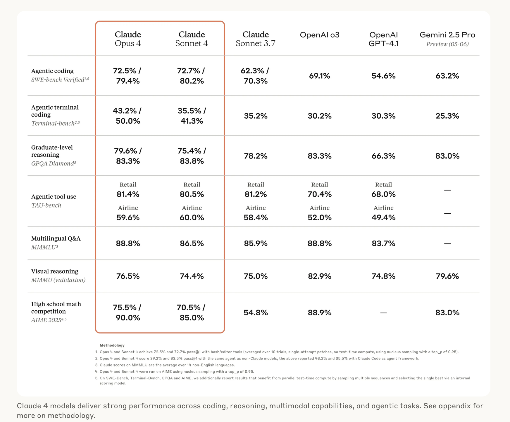

🏠 > [클로드4 (Claude4)](../) > `클로드4 (Claude4) 완벽 가이드 | 코딩, 고급 추론, AI 에이전트 작업의 혁신`

### INDEX

- [클로드4 (Claude4) 란 무엇인가?](#클로드4-claude4-란-무엇인가)
- [클로드 오푸스 4와 소넷 4의 차이점](#클로드-오푸스-4와-소넷-4의-차이점)
- [성능 비교: 오푸스 vs 소넷](#성능-비교-오푸스-vs-소넷)
- [클로드4를 선택해야 하는 이유](#클로드4를-선택해야-하는-이유)
- [참고자료](#참고자료)

---
# 클로드4 (Claude4) 완벽 가이드 
> 코딩, 고급 추론, AI 에이전트 작업의 혁신

AI 기술의 발전은 매년 새로운 혁신을 가져오고 있습니다. 그중에서도 앤트로픽(Anthropic)의 최신 AI 모델인 클로드4는 특히 주목받고 있습니다. 이번 글에서는 클로드4의 두 가지 주요 모델, 오푸스(Opus) 4와 소넷(Sonnet) 4의 성능과 기능을 비교하며, 이 모델들이 제공하는 혁신적인 가능성을 살펴보겠습니다.

## 클로드4 (Claude4) 란 무엇인가?
클로드4 (Claude4) 는 앤트로픽이 개발한 차세대 AI 모델로, 특히 **코딩, 고급 추론, AI 에이전트 작업** 에서 뛰어난 성능을 자랑합니다.  
클로드4는 두 가지 주요 모델인 `오푸스4(Opus4)` 와 `소넷4(Sonnet4)` 으로 나뉘며, 각각의 모델은 특정 작업에 최적화되어 있습니다. 이 모델은 기존 AI 모델의 한계를 뛰어넘어 더 정교하고 신뢰할 수 있는 결과를 제공합니다.

### 클로드4의 출시 배경과 목적
클로드4는 이전 모델인 클로드 3.7의 한계를 극복하고, 더 높은 수준의 지능과 효율성을 제공하기 위해 개발되었습니다. 앤트로픽은 클로드4를 통해 AI 기술의 새로운 기준을 제시하고자 했으며, 특히 코딩, 고급 추론, 그리고 AI 에이전트 작업에서의 성능 향상을 목표로 삼았습니다.  

클로드4의 개발 목적은 단순히 기술적 성능을 높이는 것에 그치지 않습니다. 이 모델은 사용자 경험을 개선하고, 더 직관적이고 신뢰할 수 있는 AI 솔루션을 제공하는 데 중점을 두고 있습니다. 예를 들어, 클로드4는 확장된 컨텍스트 윈도우(최대 200K 토큰)를 통해 더 많은 데이터를 처리하고, 복잡한 작업을 보다 효율적으로 수행할 수 있습니다.

### 클로드4의 주요 특징
클로드4는 다음과 같은 주요 특징을 가지고 있습니다:

- **하이브리드 추론 모델:** 클로드4는 즉각적인 응답과 단계별 심층 추론을 모두 지원합니다. 이를 통해 사용자는 상황에 따라 최적의 응답 방식을 선택할 수 있습니다.
- **확장된 컨텍스트 윈도우:** 최대 200K 토큰을 처리할 수 있는 컨텍스트 윈도우를 제공하여, 대규모 데이터 분석과 긴 문서 처리에 적합합니다.
- **도구 사용 능력:** 클로드4는 웹 검색, 코드 실행 등 다양한 도구를 활용하여 복잡한 작업을 수행할 수 있습니다.
- **안전성과 신뢰성:** 앤트로픽은 클로드4의 안전성과 신뢰성을 보장하기 위해 철저한 테스트와 평가를 진행했습니다.

 

[[TOP]](#index)

---
## 클로드 오푸스 4와 소넷 4의 차이점
클로드4는 두 가지 주요 모델, 오푸스 4와 소넷 4로 나뉩니다. 이 두 모델은 각각의 강점과 용도에 따라 차별화된 기능을 제공합니다.

### 클로드 오푸스 4의 주요 기능
클로드 오푸스 4는 고급 코딩과 복잡한 문제 해결에 특화된 모델입니다. 주요 기능은 다음과 같습니다:

- **코딩 성능:** SWE-bench에서 72.5%의 점수를 기록하며, 세계 최고의 코딩 모델로 평가받고 있습니다.
- **장기 작업 처리:** 오푸스 4는 수 시간 동안 지속적으로 작업을 수행할 수 있는 능력을 가지고 있습니다.
- **에이전트 작업:** 복잡한 에이전트 워크플로우를 처리하며, 고급 AI 에이전트 애플리케이션에 적합합니다.

|  |
|:---:|
| Fig1. 클로드 4 성능 벤치마크 | 

### 클로드 소넷 4의 주요 기능
클로드 소넷 4는 실용성과 효율성을 중시하는 모델로, 다음과 같은 기능을 제공합니다:

- **빠른 응답 속도:** 소넷 4는 즉각적인 응답이 필요한 작업에 적합합니다.
- **코딩 및 데이터 분석:** SWE-bench에서 72.7%의 점수를 기록하며, 코딩과 데이터 분석에서 뛰어난 성능을 발휘합니다.
- **사용자 친화적 인터페이스:** 소넷 4는 사용자 경험을 최적화하기 위해 설계되었습니다.

 

[[TOP]](#index)

---
## 성능 비교: 오푸스 vs 소넷
오푸스 4와 소넷 4는 각각의 강점에 따라 성능이 다릅니다. 아래에서 두 모델의 주요 성능 지표를 비교해 보겠습니다.

처리 속도 및 정확도 비교
오푸스 4는 복잡한 작업에서 높은 정확도를 제공하며, 소넷 4는 빠른 응답 속도를 자랑합니다. 예를 들어, 오푸스 4는 장기적인 코딩 작업에서 뛰어난 성능을 발휘하며, 소넷 4는 실시간 데이터 분석과 같은 작업에 적합합니다.

데이터 처리 용량 및 효율성 비교
두 모델 모두 200K 토큰의 컨텍스트 윈도우를 지원하지만, 오푸스 4는 더 복잡한 데이터 세트를 처리하는 데 최적화되어 있습니다. 반면, 소넷 4는 효율적인 데이터 처리와 비용 절감에 중점을 둡니다.

오푸스4 vs 소넷4 주요 차이점
오푸스와 소넷은 다음과 같은 차이점을 가지고 있습니다:

특징	오푸스(Opus)	소넷(Sonnet)
주요 용도	고급 코딩, 복잡한 문제 해결	일반적인 코딩, 일상적인 작업
성능	높은 정확도와 지속적인 작업 수행 능력	빠른 응답과 효율성
오푸스는 특히 고급 코딩 작업에서 뛰어난 성능을 발휘하며, 소넷은 일상적인 작업에서 효율성을 제공합니다.

 

[[TOP]](#index)

---
## 클로드4의 실제 활용 사례
클로드4는 다양한 산업에서 혁신적인 솔루션을 제공하고 있습니다. 아래는 오푸스 4와 소넷 4의 실제 활용 사례입니다.

클로드 오푸스 4의 활용 사례
소프트웨어 개발: 오푸스 4는 복잡한 코드베이스를 이해하고, 대규모 리팩토링 작업을 수행할 수 있습니다.
AI 에이전트: 오푸스 4는 고급 AI 에이전트 애플리케이션을 지원하며, 복잡한 워크플로우를 자동화합니다.
클로드 소넷 4의 활용 사례
고객 지원: 소넷 4는 고객 지원 에이전트로 활용되어, 빠르고 정확한 응답을 제공합니다.
콘텐츠 생성: 소넷 4는 고품질의 콘텐츠를 생성하며, 마케팅 및 광고 캠페인에 활용됩니다.

 

[[TOP]](#index)

---
## 클로드4를 선택해야 하는 이유
클로드4는 경쟁 모델과 비교해 다음과 같은 차별점을 가지고 있습니다:

클로드4의 경쟁 모델과의 차별점
하이브리드 추론: 클로드4는 즉각적인 응답과 심층 추론을 모두 지원하여, 다양한 요구사항에 대응할 수 있습니다.
확장된 컨텍스트 윈도우: 최대 200K 토큰을 처리할 수 있는 능력은 경쟁 모델 대비 큰 장점입니다.
클로드4의 미래 전망
클로드4는 AI 기술의 미래를 선도할 잠재력을 가지고 있습니다. 앤트로픽은 지속적인 연구와 개발을 통해 클로드4의 성능을 더욱 향상시킬 계획입니다.

클로드4는 AI 기술의 새로운 기준을 제시하며, 다양한 산업에서 혁신적인 솔루션을 제공합니다. 클로드 오푸스 4와 클로드 소넷 4의 강점을 활용하여, 여러분의 비즈니스를 한 단계 도약시켜 보세요. 더 자세한 정보는 앤트로픽 공식 웹사이트에서 확인하실 수 있습니다.

 

[[TOP]](#index)

---
## 참고자료
Introducing Claude 4 \ Anthropic
Claude Opus 4 \ Anthropic
Claude Sonnet 4 \ Anthropic

 

[[TOP]](#index)

---