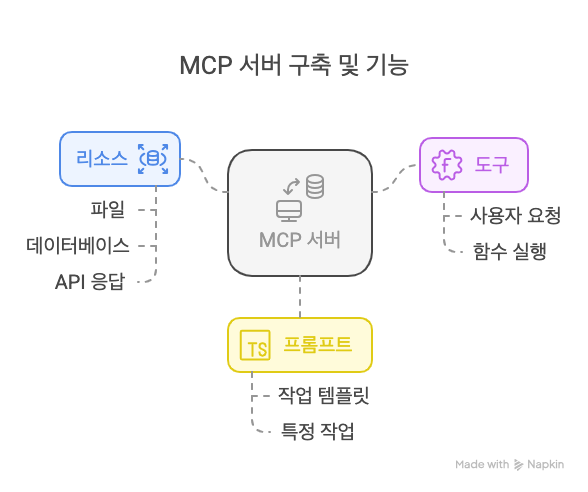
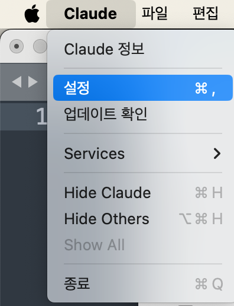
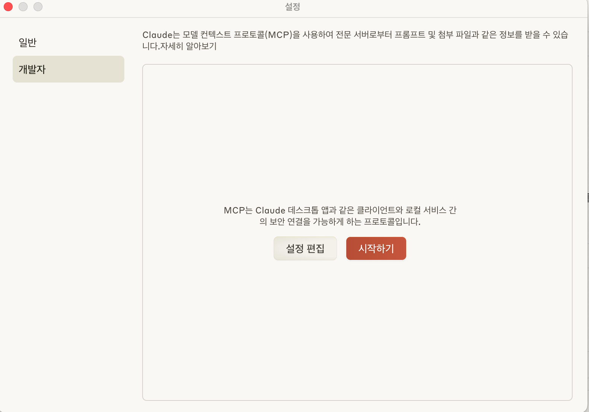

🏠 > [클로드4 (Claude4)](../../) > [MCP](../) > `MCP 서버 총정리 | 사용법 및 구축 방법 까지 10분 만에 완성하는 초보자 가이드`

### INDEX

- [MCP 서버 총정리](#mcp-서버-총정리)
- [MCP 서버란 무엇인가?](#mcp-서버란-무엇인가)
- [MCP 서버 구축을 위한 사전 준비](#mcp-서버-구축을-위한-사전-준비)
- [MCP 서버 구축 단계별 가이드](#mcp-서버-구축-단계별-가이드)
- [Claude Desktop과 MCP 서버 연결하기](#claude-desktop과-mcp-서버-연결하기)
- [MCP 서버 디버깅 및 문제 해결](#mcp-서버-디버깅-및-문제-해결)
- [MCP 서버 확장 및 최적화](#mcp-서버-확장-및-최적화)
- [실제 사례: 날씨 정보 제공 MCP 서버](#실제-사례-날씨-정보-제공-mcp-서버)
- [결론](#결론)
- [참고자료](#참고자료) 

---
# MCP 서버 총정리 
> 사용법 및 구축 방법 까지 10분 만에 완성하는 초보자 가이드

MCP 서버를 구축하고 설정하는 것은 처음에는 복잡해 보일 수 있지만, 올바른 가이드와 도구를 사용하면 누구나 쉽게 시작할 수 있습니다. 이 글에서는 MCP 서버의 기본 개념부터 설치, 설정, 확장 방법까지 단계별로 설명합니다. 초보자도 따라 할 수 있도록 간단하고 명확하게 작성했으니, 끝까지 읽어보세요!

## MCP 서버란 무엇인가?
MCP 서버는 [**MCP(모델 컨텍스트 프로토콜)**](../mcp/) 의 일부로, 대규모 언어 모델(LLM)이 외부 데이터 소스와 도구에 접근할 수 있도록 돕는 프로그램입니다. 이는 AI 시스템과 외부 시스템 간의 상호작용을 표준화하여, 데이터를 효율적으로 교환하고 작업을 수행할 수 있게 합니다.

### MCP 서버의 역할
MCP 서버는 LLM이 외부 데이터와 상호작용할 수 있도록 지원합니다. 예를 들어, 파일 읽기, API 호출, 데이터베이스 접근 등을 가능하게 합니다. 이를 통해 LLM의 기능을 확장하고, 사용자 경험을 개선할 수 있습니다.

### MCP 서버를 사용하는 이유
MCP 서버를 사용하면 다음과 같은 이점이 있습니다:

- **데이터 접근성 향상:** LLM이 실시간 데이터에 접근 가능
- **기능 확장:** 기존 AI 모델에 새로운 도구와 기능 추가
- **표준화된 통합:** 다양한 LLM과 호환 가능

### MCP 서버의 주요 기능
MCP 서버는 크게 세 가지 기능을 제공합니다:

|  |
|:---:|
| Fig1. MCP 서버 세가지 기능 |

- **리소스(Resources):** 파일, 데이터베이스, API 응답 등 읽기 전용 데이터 제공
- **도구(Tools):** 사용자 요청에 따라 실행 가능한 함수 제공
- **프롬프트(Prompts):** 특정 작업을 수행하기 위한 템플릿 제공

10분이면 충분합니다. 지금 바로 시작해보세요! <br/>
[[MCP 서버 구축하기]](https://modelcontextprotocol.io/docs/getting-started/intro)

<br/>

[[TOP]](#index)

---
## MCP 서버 구축을 위한 사전 준비
MCP 서버를 구축하기 전에 필요한 소프트웨어와 하드웨어를 준비해야 합니다. 아래는 필수 준비 사항입니다.

### 필요한 소프트웨어 및 하드웨어 요구사항
- 운영 체제: Windows, macOS, Linux
- Python 3.10 이상: MCP SDK 설치를 위해 필요
- Claude Desktop: MCP 서버 테스트 및 통합 (macOS, Windows 지원)

### MCP 프레임워크 다운로드 및 설치 - Python 버전
MCP 프레임워크는 MCP 서버의 핵심입니다.

**Python:**
```python
# uv 설치 (권장)
curl -LsSf https://astral.sh/uv/install.sh | sh

# 프로젝트 생성 및 설정
uv init my-first-mcp-server
cd my-first-mcp-server
uv venv
source .venv/bin/activate
uv add "mcp[cli]" httpx
```

### 개발 환경 설정
VS Code나 Cursor AI 와 같은 IDE를 사용하면 개발 생산성을 높일 수 있습니다.

<br/>

[[TOP]](#index)

---
## MCP 서버 구축 단계별 가이드
이제 MCP 서버를 구축하는 구체적인 단계를 살펴보겠습니다.

### 1. 기본 MCP 서버 구현

#### Python을 이용한 기본 서버 구현
- 프로젝트 생성 및 설정 방법
```shell
# 프로젝트를 위한 새 디렉토리 생성
uv init weather
cd weather

# 가상 환경 생성 및 활성화
uv venv
source .venv/bin/activate

# 의존성 설치
uv add "mcp[cli]" httpx

# 서버 파일 생성
touch weather.py
```

- 패키지 가져오기 및 인스턴스 설정
`weather.py` 파일 상단에 다음 코드를 추가합니다:
```python
from typing import Any
import httpx
from mcp.server.fastmcp import FastMCP

# FastMCP 서버 초기화
mcp = FastMCP("weather")

# 상수
NWS_API_BASE = "https://api.weather.gov"
USER_AGENT = "weather-app/1.0"
```

FastMCP 클래스는 Python 타입 힌트와 독스트링을 활용하여 도구 정의를 자동으로 생성하므로 MCP 도구를 쉽게 만들고 관리할 수 있습니다.

- 헬퍼 함수
다음으로 National Weather Service API에서 데이터를 쿼리하고 형식을 지정하는 헬퍼 함수를 추가합니다:
```python
async def make_nws_request(url: str) -> dict[str, Any] | None:
    """NWS API에 적절한 오류 처리로 요청합니다."""
    headers = {
        "User-Agent": USER_AGENT,
        "Accept": "application/geo+json"
    }
    async with httpx.AsyncClient() as client:
        try:
            response = await client.get(url, headers=headers, timeout=30.0)
            response.raise_for_status()
            return response.json()
        except Exception:
            return None

def format_alert(feature: dict) -> str:
    """알림 기능을 읽기 쉬운 문자열로 형식화합니다."""
    props = feature["properties"]
    return f"""
이벤트: {props.get('event', '알 수 없음')}
지역: {props.get('areaDesc', '알 수 없음')}
심각도: {props.get('severity', '알 수 없음')}
설명: {props.get('description', '설명 없음')}
지침: {props.get('instruction', '특별한 지침 없음')}
"""
```

#### 도구 실행 구현
도구 실행 핸들러는 각 도구의 로직을 실제로 실행하는 역할을 합니다:
```python
@mcp.tool()
async def get_alerts(state: str) -> str:
    """미국 주의 기상 알림을 가져옵니다.

    Args:
        state: 두 글자 미국 주 코드 (예: CA, NY)
    """
    url = f"{NWS_API_BASE}/alerts/active/area/{state}"
    data = await make_nws_request(url)

    if not data or "features" not in data:
        return "알림을 가져올 수 없거나 알림이 없습니다."

    if not data["features"]:
        return "이 주에 대한 활성 알림이 없습니다."

    alerts = [format_alert(feature) for feature in data["features"]]
    return "\n---\n".join(alerts)

@mcp.tool()
async def get_forecast(latitude: float, longitude: float) -> str:
    """위치에 대한 기상 예보를 가져옵니다.

    Args:
        latitude: 위치의 위도
        longitude: 위치의 경도
    """
    # 먼저 예보 그리드 엔드포인트 가져오기
    points_url = f"{NWS_API_BASE}/points/{latitude},{longitude}"
    points_data = await make_nws_request(points_url)

    if not points_data:
        return "이 위치에 대한 예보 데이터를 가져올 수 없습니다."

    # 포인트 응답에서 예보 URL 가져오기
    forecast_url = points_data["properties"]["forecast"]
    forecast_data = await make_nws_request(forecast_url)

    if not forecast_data:
        return "상세 예보를 가져올 수 없습니다."

    # 기간을 읽기 쉬운 예보로 포맷팅
    periods = forecast_data["properties"]["periods"]
    forecasts = []
    for period in periods[:5]:  # 다음 5개 기간만 표시
        forecast = f"""
{period['name']}:
온도: {period['temperature']}°{period['temperatureUnit']}
바람: {period['windSpeed']} {period['windDirection']}
예보: {period['detailedForecast']}
"""
        forecasts.append(forecast)

    return "\n---\n".join(forecasts)
```

#### 서버 실행
마지막으로 서버를 초기화하고 실행합니다:

if __name__ == "__main__":
    # 서버 초기화 및 실행
    mcp.run(transport='stdio')

이제 서버가 완성되었습니다! uv run weather.py를 실행하여 모든 것이 제대로 작동하는지 확인하세요.

uv run weather.py

이제 기존 MCP 호스트(예: Claude for Desktop)에서 서버를 테스트할 수 있습니다.

### 2. 리소스(Resources) 추가하기
리소스는 LLM이 읽을 수 있는 데이터를 제공합니다. 다음은 간단한 리소스 구현 예제입니다:

**Python 리소스 예제**
```python
from mcp.server.fastmcp import FastMCP

mcp = FastMCP("resource-server")

@mcp.resource_root()
async def info(request):
    return {
        "uri": "info://about",
        "name": "서비스 정보",
        "description": "우리 서비스에 대한 기본 정보"
    }

@mcp.resource("info://about")
async def about_info():
    return "이 서비스는 MCP 서버 예제입니다."

if __name__ == "__main__":
    mcp.run(transport='stdio')
```

### 3. 도구(Tools) 구현하기
도구는 LLM이 사용자 요청에 따라 실행할 수 있는 함수입니다. 다음은 간단한 날씨 정보 제공 도구 예제입니다:

**Python 도구 예제**
```python
from mcp.server.fastmcp import FastMCP
import httpx

mcp = FastMCP("weather-server")

NWS_API_BASE = "https://api.weather.gov"
USER_AGENT = "weather-app/1.0"

async def make_nws_request(url: str):
    """NWS API에 요청을 보내는 헬퍼 함수"""
    headers = {
        "User-Agent": USER_AGENT,
        "Accept": "application/geo+json"
    }
    async with httpx.AsyncClient() as client:
        try:
            response = await client.get(url, headers=headers, timeout=30.0)
            response.raise_for_status()
            return response.json()
        except Exception:
            return None

@mcp.tool()
async def get_forecast(latitude: float, longitude: float) -> str:
    """주어진 위치의 날씨 예보를 가져옵니다.
    
    Args:
        latitude: 위치의 위도
        longitude: 위치의 경도
    """
    # 예보 그리드 엔드포인트 가져오기
    points_url = f"{NWS_API_BASE}/points/{latitude},{longitude}"
    points_data = await make_nws_request(points_url)
    
    if not points_data:
        return "이 위치의 예보 데이터를 가져올 수 없습니다."
    
    # 예보 URL 가져오기
    forecast_url = points_data["properties"]["forecast"]
    forecast_data = await make_nws_request(forecast_url)
    
    if not forecast_data:
        return "상세 예보를 가져올 수 없습니다."
    
    # 기간을 읽기 쉬운 예보로 포맷팅
    periods = forecast_data["properties"]["periods"]
    forecasts = []
    for period in periods[:5]:  # 다음 5개 기간만 표시
        forecast = f"""
{period['name']}:
온도: {period['temperature']}°{period['temperatureUnit']}
바람: {period['windSpeed']} {period['windDirection']}
예보: {period['detailedForecast']}
"""
        forecasts.append(forecast)
    
    return "\n---\n".join(forecasts)

if __name__ == "__main__":
    mcp.run(transport='stdio')

```

### 4. 프롬프트(Prompts) 구현하기
프롬프트는 LLM에게 특정 작업 수행을 위한 템플릿을 제공합니다:

**Python 프롬프트 예제**
```python
from mcp.server.fastmcp import FastMCP

mcp = FastMCP("prompts-server")

@mcp.prompt("이메일 작성")
def email_prompt():
    return """
    다음 정보로 이메일을 작성해주세요:

    주제: {{subject}}
    수신자: {{recipient}}
    어조: {{tone}}
    주요 요점:
    
    - {{point}}
    
    """

@mcp.prompt("블로그 글 작성")
def blog_prompt():
    return """
    다음 주제로 블로그 글을 작성해주세요: {{topic}}
    
    키워드: {{keywords}}
    어조: {{tone}}
    길이: {{length}} 단어
    대상 독자: {{audience}}
    """

if __name__ == "__main__":
    mcp.run(transport='stdio')
```

<br/>

[[TOP]](#index)

---
## Claude Desktop과 MCP 서버 연결하기
개발한 MCP 서버를 Claude Desktop과 연결하는 방법은 다음과 같습니다:

### Claude Desktop 설정 방법

#### 1️⃣ Claude Desktop 다운로드 및 설치

  - macOS 또는 Windows용 Claude Desktop을 다운로드하여 설치합니다 (Linux는 아직 지원되지 않음)
  - 이미 설치되어 있다면 Claude 메뉴에서 "Check for Updates..."를 선택하여 최신 버전으로 업데이트

#### 2️⃣ Claude Desktop 구성 파일 설정

  - Claude 메뉴에서 "Settings..." 선택 (앱 내의 Claude Account Settings가 아님)

|  |
|:---:|
| Fig2. Claude Desktop 설정 메뉴 |

  - 왼쪽 메뉴에서 "Developer" 선택 후 "Edit Config(설정 편집)" 클릭

|  |
|:---:|
| Fig3. Claude Desktop MCP 설정 화면 |


  - 구성 파일 위치:
    - macOS: ~/Library/Application Support/Claude/claude_desktop_config.json
    - Windows: %APPDATA%\Claude\claude_desktop_config.json

#### 3️⃣ 구성 파일에 MCP 서버 정보 추가:
```json
{
    "mcpServers": {
        "weather": {
            "command": "uv",
            "args": [
                "--directory",
                "절대경로/weather",
                "run",
                "weather.py"
            ]
        }
    }
}
```

#### 4️⃣ Claude Desktop 재시작

<br/>

### 연결 확인 및 테스트
&nbsp;&nbsp;  ❶ Claude Desktop 시작 <br/>
&nbsp;&nbsp;  ❷ 채팅 인터페이스에서 MCP 도구 아이콘(망치 아이콘) 클릭 <br/>
&nbsp;&nbsp;  ❸ 서버 목록에서 연결할 MCP 서버 선택 <br/>
&nbsp;&nbsp;  ❹ 리소스, 도구 또는 프롬프트를 사용하여 테스트 <br/>

예시 명령:

- "오늘 서울의 날씨는 어때?"
- "내일 뉴욕의 날씨 예보를 보여줘."


<br/>

[[TOP]](#index)

---
## MCP 서버 디버깅 및 문제 해결
MCP 서버 개발 시 발생할 수 있는 문제를 해결하는 방법입니다.

### 일반적인 문제 및 해결 방법

#### 1️⃣ 서버 연결 실패
  - 파일 경로가 올바른지 확인
  - 실행 권한 확인 (chmod +x)
  - 구성 파일의 JSON 형식 확인

#### 2️⃣ 도구 실행 오류
  - 매개변수 타입 확인
  - 비동기 함수 처리 확인
  - 에러 처리 추가

#### 3️⃣ 리소스 로드 실패
  - URI 형식 확인
  - MIME 타입 설정 확인

<br/>

[[TOP]](#index)

---
## MCP 서버 확장 및 최적화
MCP 서버를 더 강력하게 만들기 위한 확장 및 최적화 방법입니다.

### 데이터베이스 연결
MCP 서버에 데이터베이스를 연결하여 동적 데이터를 제공할 수 있습니다:
```python
import sqlite3
from mcp.server.fastmcp import FastMCP

mcp = FastMCP("db-server")

def get_db_connection():
    conn = sqlite3.connect('database.db')
    conn.row_factory = sqlite3.Row
    return conn

@mcp.tool()
async def search_products(query: str) -> str:
    """제품을 검색합니다.
    
    Args:
        query: 검색어
    """
    conn = get_db_connection()
    products = conn.execute(
        'SELECT * FROM products WHERE name LIKE ? LIMIT 10', 
        (f'%{query}%',)
    ).fetchall()
    conn.close()
    
    if not products:
        return "검색 결과가 없습니다."
    
    results = []
    for product in products:
        results.append(f"ID: {product['id']}, 이름: {product['name']}, 가격: {product['price']}원")
    
    return "\n".join(results)
```

### API 통합
외부 API와 통합하여 MCP 서버의 기능을 확장할 수 있습니다:
```python
import httpx
from mcp.server.fastmcp import FastMCP

mcp = FastMCP("api-server")

@mcp.tool()
async def translate_text(text: str, target_lang: str) -> str:
    """텍스트를 번역합니다.
    
    Args:
        text: 번역할 텍스트
        target_lang: 대상 언어 코드 (예: 'en', 'ja', 'zh')
    """
    API_URL = "https://api.example-translator.com/translate"
    API_KEY = "your-api-key"  # 실제 환경에서는 환경 변수 사용 권장
    
    async with httpx.AsyncClient() as client:
        response = await client.post(
            API_URL,
            json={"text": text, "target": target_lang},
            headers={"Authorization": f"Bearer {API_KEY}"}
        )
        
        if response.status_code != 200:
            return f"번역 오류: {response.text}"
        
        data = response.json()
        return data["translated_text"]
```

### 성능 최적화 팁
MCP 서버의 성능을 개선하기 위한 팁:

#### 1️⃣ 비동기 처리 활용
  - Python에서는 async/await 사용
  - JavaScript에서는 Promise 활용

#### 2️⃣ 캐싱 구현
  - 자주 요청되는 데이터 캐싱
  - Redis와 같은 인메모리 캐시 활용

#### 3️⃣ 리소스 효율적 관리
  - 커넥션 풀 사용
  - 메모리 누수 방지

#### 4️⃣ 에러 처리 강화
  - 예외 상황 대비
  - 적절한 오류 메시지 제공


<br/>

[[TOP]](#index)

---
## 실제 사례: 날씨 정보 제공 MCP 서버
실제 작동하는 날씨 정보 제공 MCP 서버의 전체 코드입니다. 이 예제를 통해 MCP 서버의 기능을 종합적으로 이해할 수 있습니다.
```python
from typing import Any
import httpx
from mcp.server.fastmcp import FastMCP

# FastMCP 서버 초기화
mcp = FastMCP("weather")

# 상수
NWS_API_BASE = "https://api.weather.gov"
USER_AGENT = "weather-app/1.0"

# 헬퍼 함수
async def make_nws_request(url: str) -> dict[str, Any] | None:
    """NWS API에 요청을 보내는 함수"""
    headers = {
        "User-Agent": USER_AGENT,
        "Accept": "application/geo+json"
    }
    async with httpx.AsyncClient() as client:
        try:
            response = await client.get(url, headers=headers, timeout=30.0)
            response.raise_for_status()
            return response.json()
        except Exception:
            return None

def format_alert(feature: dict) -> str:
    """경보 정보를 가독성 있게 포맷팅"""
    props = feature["properties"]
    return f"""
이벤트: {props.get('event', '알 수 없음')}
지역: {props.get('areaDesc', '알 수 없음')}
심각도: {props.get('severity', '알 수 없음')}
설명: {props.get('description', '설명 없음')}
지침: {props.get('instruction', '특별한 지침 없음')}
"""

# 도구 구현
@mcp.tool()
async def get_alerts(state: str) -> str:
    """미국 주별 날씨 경보를 가져옵니다.
    
    Args:
        state: 미국 주 코드 (예: CA, NY)
    """
    url = f"{NWS_API_BASE}/alerts/active/area/{state}"
    data = await make_nws_request(url)
    
    if not data or "features" not in data:
        return "경보를 가져올 수 없거나 경보가 없습니다."
    
    if not data["features"]:
        return "이 주에 활성화된 경보가 없습니다."
    
    alerts = [format_alert(feature) for feature in data["features"]]
    return "\n---\n".join(alerts)

@mcp.tool()
async def get_forecast(latitude: float, longitude: float) -> str:
    """위치 기반 날씨 예보를 가져옵니다.
    
    Args:
        latitude: 위치의 위도
        longitude: 위치의 경도
    """
    # 예보 그리드 엔드포인트 가져오기
    points_url = f"{NWS_API_BASE}/points/{latitude},{longitude}"
    points_data = await make_nws_request(points_url)
    
    if not points_data:
        return "이 위치의 예보 데이터를 가져올 수 없습니다."
    
    # 예보 URL 가져오기
    forecast_url = points_data["properties"]["forecast"]
    forecast_data = await make_nws_request(forecast_url)
    
    if not forecast_data:
        return "상세 예보를 가져올 수 없습니다."
    
    # 기간을 읽기 쉬운 예보로 포맷팅
    periods = forecast_data["properties"]["periods"]
    forecasts = []
    for period in periods[:5]:  # 다음 5개 기간만 표시
        forecast = f"""
{period['name']}:
온도: {period['temperature']}°{period['temperatureUnit']}
바람: {period['windSpeed']} {period['windDirection']}
예보: {period['detailedForecast']}
"""
        forecasts.append(forecast)
    
    return "\n---\n".join(forecasts)

# 서버 실행
if __name__ == "__main__":
    mcp.run(transport='stdio')

```

<br/>

[[TOP]](#index)

---
## 결론
MCP 서버는 AI 모델과 외부 시스템을 연결하는 강력한 도구입니다. 이 가이드에서는 MCP 서버의 기본 개념부터 구축, 설정, 확장까지 단계별로 알아보았습니다.

이제 여러분은 다음을 할 수 있게 되었습니다:

  - MCP 서버의 핵심 개념 이해
  - 기본 MCP 서버 구축
  - 리소스, 도구, 프롬프트 구현
  - Claude Desktop과 연결 설정
  - 문제 해결 및 디버깅
  - MCP 서버 확장 및 최적화

MCP 기술은 계속 발전하고 있으며, 이를 통해 AI 모델의 가능성이 더욱 확장될 것입니다. 이 가이드가 여러분의 MCP 서버 구축 여정에 도움이 되길 바랍니다!

이제 당신만의 MCP 서버를 만들 차례입니다!
[[지금 시작하기]](https://modelcontextprotocol.io/docs/getting-started/intro)

<br/>

[[TOP]](#index)

---
## 참고자료
- [Model Context Protocol 공식 문서](https://modelcontextprotocol.io/docs/getting-started/intro)
- [Model Context Protocol (MCP) Tutorial](https://modelcontextprotocol.io/docs/getting-started/intro)

<br/>

[[TOP]](#index)

---