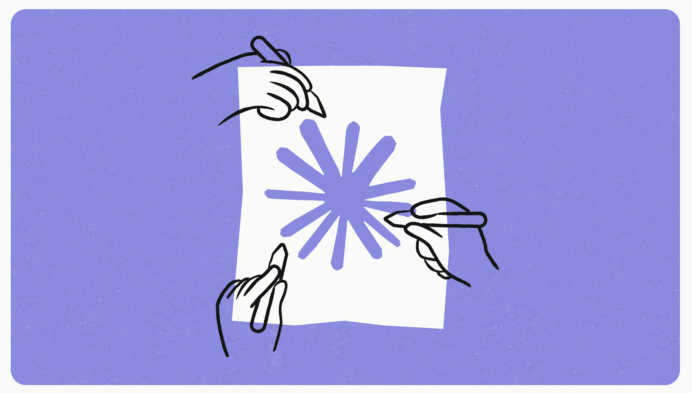
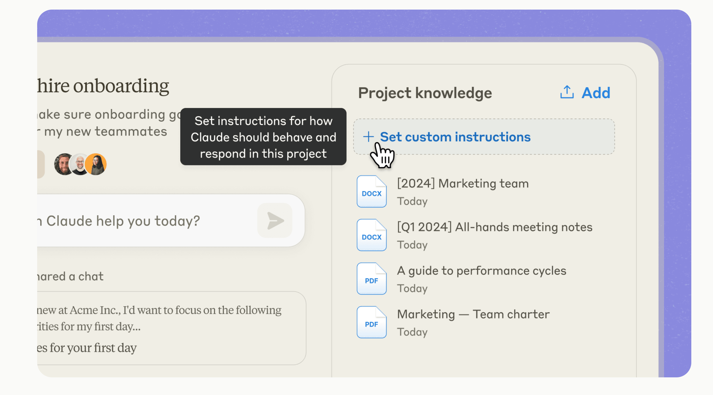
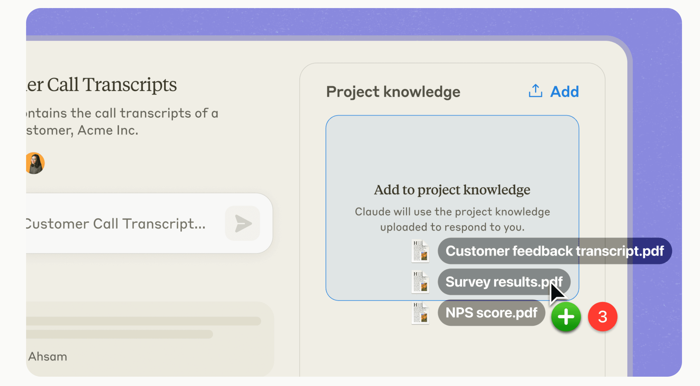
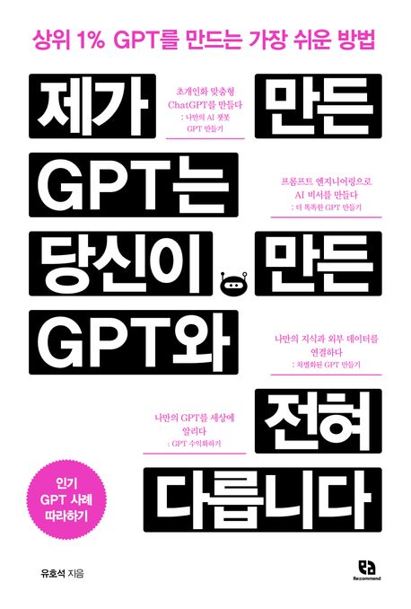

🏠 > [클로드4 (Claude4)](../) > `클로드 프로젝트(Claude Projects)란? GPTs와 같은 맞춤형 클로드 사용법`

### INDEX

- [1. 클로드 프로젝트 (Claude Projects) 란?](#1-클로드-프로젝트-claude-projects-란)
- [2. 클로드 프로젝트의 핵심 기능](#2-클로드-프로젝트의-핵심-기능)
- [3. 클로드 프로젝트 vs GPTs](#3-클로드-프로젝트-vs-gpts)
- [4. 클로드 프로젝트의 활용 사례](#4-클로드-프로젝트의-활용-사례)
- [5. 클로드 프로젝트의 미래 전망](#5-클로드-프로젝트의-미래-전망)
- [6. 결론](#6-결론)
- []()

---
# 클로드 프로젝트(Claude Projects)란? 
> GPTs와 같은 맞춤형 클로드 사용법

AI 기술의 발전으로 우리의 업무 방식이 빠르게 변화하고 있습니다. 그 중심에 앤트로픽(Anthropic)의 클로드(Claude)가 있습니다. 최근 앤트로픽은 클로드 소셋 3.5와 아티펙트 기능에 이어 'Claude Projects'라는 혁신적인 기능을 선보였는데요. 이는 AI와의 협업을 한 단계 더 발전시킨 획기적인 도구입니다. 이 글에서는 클로드 프로젝트가 무엇인지, 어떻게 활용할 수 있는지 자세히 알아보겠습니다.

## 1. 클로드 프로젝트 (Claude Projects) 란?
클로드 프로젝트(Claude Projects)는 앤트로픽(Anthropic)이 개발한 혁신적인 AI 협업 도구 입니다.



클로드 프로젝트는 OpenAI의 맞춤형 GPT(GPTs)와 유사한 기능을 제공하면서도, 클로드의 강력한 성능을 활용할 수 있게 해줍니다. 사용자들은 이를 통해 자신만의 맞춤형 AI 환경을 구축하고, 팀원들과 함께 AI의 도움을 받아 효율적으로 작업할 수 있습니다.

클로드 3.5 소넷을 기반으로 한 이 프로젝트는 AI와의 협업을 새로운 차원으로 끌어올리는 획기적인 도구입니다. 단순한 질의응답을 넘어, 복잡한 프로젝트 관리와 팀 협업을 위한 다양한 기능을 제공합니다.

### 클로드 프로젝트 (Claude Projects) 주요 특징
  - 맞춤형 Custom Instructions 설정
  - 맞춤형 지식 기반 구축
  - 200K 컨텍스트 창 지원
  - 팀 공유 기능
  - 아티팩트(Artifacts) 생성 기능

이러한 특징들을 통해 클로드 프로젝트는 단순한 챗봇을 넘어 진정한 AI 협업 도구로 자리매김하고 있습니다.

<br/>

[[TOP]](#index)

---
## 2. 클로드 프로젝트의 핵심 기능

### 2.1 Custom Instructions 설정
클로드 프로젝트의 핵심 기능 중 하나는 Custom Instructions입니다. 이 기능을 통해 사용자는 AI의 행동 방식, 지식 적용 방법, 응답 스타일을 세밀하게 조정할 수 있습니다.

|  |
|:---:|
| Fig1. 클로드 프로젝트 Custom Instructions 설정 |

- **역할 및 전문성 정의:** AI에게 특정 역할이나 전문 분야를 부여할 수 있습니다.
```
당신은 10년 경력의 금융 애널리스트입니다. 항상 최신 시장 동향을 고려하여 답변해 주세요.
```

- **응답 스타일 설정:** AI의 커뮤니케이션 스타일을 조절할 수 있습니다.
```
공식적이고 전문적인 어조를 유지하되, 필요시 간단한 비유를 사용하여 설명해 주세요.
```

- **특정 정보 강조:** AI가 응답 시 항상 고려해야 할 중요 정보를 지정할 수 있습니다.
```
모든 제안에서 데이터 보안과 사용자 프라이버시를 최우선으로 고려해 주세요.
```

이러한 세밀한 조정을 통해, 사용자는 프로젝트의 목적에 완벽하게 부합하는 AI 어시스턴트를 만들 수 있습니다.

### 2.1 맞춤형 지식 기반 구축
클로드 프로젝트는 사용자가 직접 AI의 지식 기반을 구축할 수 있게 해줍니다. 프로젝트에 필요한 문서, 코드, 가이드라인 등을 업로드하면 클로드는 이를 학습하여 해당 프로젝트에 특화된 지식을 갖추게 됩니다.

|  |
|:---:|
| Fig2. 클로드 프로젝트 맞춤형 지식 설정 |

이 기능의 장점은 다음과 같습니다:

  - **기업 특화 지식:** 기업의 내부 정보나 특정 분야의 전문 지식을 AI에게 주입할 수 있습니다.
  - **최신 정보 반영:** 실시간으로 변하는 정보를 AI에게 업데이트할 수 있습니다.
  - **보안 강화:** 민감한 정보를 외부에 노출하지 않고 AI에게 학습시킬 수 있습니다.

### 2.2 200K 컨텍스트 창
클로드 프로젝트는 무려 200K(약 500페이지 분량)의 컨텍스트 창을 제공합니다. 이는 대화의 맥락을 오래 유지할 수 있다는 것을 의미합니다.

| 기능 | 설명 |
|-----|-----|
| 긴 문서 처리    | 장문의 보고서나 논문도 한 번에 처리 가능 |
| 복잡한 질의 응답 | 여러 단계의 질문에도 일관된 답변 제공 |
| 장기 메모리     | 이전 대화 내용을 오래 기억하여 활용 |

이 기능은 특히 복잡한 프로젝트나 깊이 있는 연구 작업에 큰 도움이 됩니다.

### 2.3 팀 공유 기능
클로드 프로젝트는 팀원들과의 협업을 위한 다양한 기능을 제공합니다.

  - **프로젝트 공유:** 팀원들과 프로젝트를 공유하여 같은 지식 기반으로 AI와 대화할 수 있습니다.
  - **대화 스냅샷 공유:** 유용한 대화 내용을 팀원들과 공유할 수 있습니다.
  - **활동 피드:** 팀원들의 AI 활용 사례를 볼 수 있어 서로의 노하우를 배울 수 있습니다.

이러한 기능들을 통해 팀 전체의 AI 활용 능력을 향상시킬 수 있습니다.

### 2.4 아티팩트(Artifacts) 생성 기능
아티팩트는 클로드가 생성한 콘텐츠를 별도의 창에 표시하는 기능입니다. 코드, 문서, 다이어그램 등 다양한 형태의 콘텐츠를 아티팩트로 생성할 수 있습니다.

```python
# 아티팩트 예시: 파이썬 코드
def factorial(n):
    if n == 0:
        return 1
    else:
        return n * factorial(n-1)

print(factorial(5))  # 출력: 120
```

이 기능을 통해 사용자는 AI와의 대화 결과물을 더욱 효과적으로 관리하고 활용할 수 있습니다.

<br/>

[[TOP]](#index)

---
## 3. 클로드 프로젝트 vs GPTs
클로드 프로젝트는 GPTs와 유사한 맞춤형 AI 챗봇 기능을 제공하지만, 몇 가지 중요한 차이점이 있습니다:

  - **더 넓은 컨텍스트 창:** 클로드 프로젝트의 200K 컨텍스트 창은 GPTs보다 더 많은 정보를 한 번에 처리할 수 있습니다.
  - **고급 커스터마이징:** Custom Instructions를 통해 더 세밀한 AI 행동 조정이 가능합니다.
  - **팀 협업 기능:** 프로젝트 공유와 활동 피드 등을 통해 팀 단위의 AI 활용을 지원합니다.
  - **아티팩트 기능:** 별도의 창에서 AI 생성 콘텐츠를 관리할 수 있어 작업 효율성이 높습니다.
  - **더 강력한 기반 모델:** 클로드 3.5 소넷의 뛰어난 성능을 활용할 수 있습니다.

<br/>

[[TOP]](#index)

---
## 4. 클로드 프로젝트의 활용 사례

### 4.1 제품 개발
제품 개발 팀은 클로드 프로젝트를 통해 아이디어 구상부터 프로토타입 제작까지 AI의 도움을 받을 수 있습니다.

  - **아이디어 브레인스토밍:** AI와의 대화를 통해 새로운 제품 아이디어를 발굴합니다.
  - **시장 분석:** 업로드된 시장 조사 데이터를 바탕으로 AI가 심층적인 분석을 제공합니다.
  - **기술적 타당성 검토:** AI가 제품의 기술적 구현 가능성을 평가하고 조언합니다.
  - **프로토타입 설계:** AI의 제안을 바탕으로 초기 프로토타입을 설계합니다.

### 4.2 마케팅 전략 수립
마케팅 팀은 클로드 프로젝트를 활용하여 데이터 기반의 마케팅 전략을 수립할 수 있습니다.

  - **고객 세그먼테이션:** AI가 고객 데이터를 분석하여 세분화된 타겟 그룹을 제안합니다.
  - **콘텐츠 전략:** AI가 트렌드 분석을 통해 효과적인 콘텐츠 주제와 형식을 제안합니다.
  - **캠페인 최적화:** 과거 캠페인 결과를 AI가 분석하여 개선점을 도출합니다.
  - **ROI 예측:** AI가 다양한 마케팅 시나리오의 ROI를 예측하여 의사결정을 돕습니다.

### 4.3 고객 서비스 품질 향상
고객 서비스 팀은 클로드 프로젝트를 통해 서비스 품질을 크게 개선할 수 있습니다.

  - **지능형 FAQ:** AI가 FAQ를 학습하여 복잡한 고객 질문에도 정확히 답변합니다.
  - **감정 분석:** AI가 고객의 메시지에서 감정을 분석하여 적절한 대응 방식을 제안합니다.
  - **에스컬레이션 예측:** AI가 복잡한 문의를 식별하여 적시에 전문 상담원에게 연결합니다.
  - **개인화된 추천:** 고객의 이전 구매 이력과 선호도를 분석하여 맞춤형 제품을 추천합니다.

<br/>

[[TOP]](#index)

---
## 5. 클로드 프로젝트의 미래 전망
클로드 프로젝트는 AI 협업 도구의 새로운 표준을 제시하고 있으며, 앞으로 더욱 발전할 것으로 예상됩니다.


### 5.1 기술적 발전
  - **더 큰 컨텍스트 창:** 현재 200K의 컨텍스트 창이 더욱 확장될 가능성이 있습니다.
  - **다중 모달리티 지원:** 텍스트뿐만 아니라 이미지, 음성, 비디오 등 다양한 형태의 입력을 처리할 수 있게 될 것입니다.
  - **실시간 학습:** 사용자와의 상호작용을 통해 실시간으로 학습하고 개선되는 기능이 추가될 수 있습니다.

### 5.2 비즈니스 임팩트
  - **의사결정 지원:** 복잡한 비즈니스 의사결정 과정에서 AI의 역할이 더욱 중요해질 것입니다.
  - **업무 자동화:** 반복적이고 시간 소모적인 업무들이 AI에 의해 더 많이 자동화될 것입니다.
  - **새로운 비즈니스 모델:** AI 협업을 중심으로 한 새로운 형태의 비즈니스 모델이 등장할 수 있습니다.

### 5.3 윤리적 고려사항
  - **AI 편향성 관리:** AI의 의사결정 과정에서 발생할 수 있는 편향성을 지속적으로 모니터링하고 관리해야 합니다.
  - **투명성 확보:** AI의 판단 근거를 명확히 설명할 수 있는 '설명 가능한 AI' 기술의 중요성이 더욱 커질 것입니다.
  - **데이터 프라이버시:** 개인정보 보호에 대한 규제가 강화됨에 따라, 이를 준수하면서 AI를 활용하는 방안이 더욱 중요해질 것입니다.

<br/>

[[TOP]](#index)

---
## 6. 결론
AI 기술의 발전과 함께 클로드 프로젝트도 계속 진화할 것으로 예상됩니다. 앞으로 더 많은 기업들이 이러한 AI 협업 도구를 도입하여 경쟁력을 강화할 것입니다. 클로드 프로젝트를 통해 여러분의 팀도 AI 시대의 선두주자가 되어보는 것은 어떨까요?

클로드 프로젝트는 단순한 기술 도구를 넘어, 우리의 일하는 방식을 근본적으로 변화시킬 수 있는 잠재력을 가지고 있습니다. 이를 효과적으로 활용하기 위해서는 기술적인 이해뿐만 아니라, 조직 문화의 변화와 새로운 협업 방식에 대한 적응이 필요할 것입니다.

미래의 직장에서는 인간과 AI가 각자의 강점을 살려 협력하는 모습이 일반화될 것입니다. 클로드 프로젝트는 이러한 미래를 앞당기는 중요한 도구가 될 것입니다. 지금이야말로 이 혁신적인 플랫폼을 탐험하고, 여러분의 업무와 조직에 어떻게 적용할 수 있을지 고민해볼 때입니다.

더 자세한 내용은 [[앤트로픽 공식 웹사이트]](https://www.anthropic.com/news/projects) 에서 확인할 수 있습니다. 클로드 프로젝트와 함께 AI 협업의 새로운 시대를 열어가세요!

#### 제가 만든 GPT는 당신이 만든 GPT와 전혀 다릅니다
GPT에 대해 궁금하시고 관심 있으신 분들을 위하여 GPT 개발 경험을 모두 담아 GPT 관련 책을 출간 하였습니다.




<div style="display: grid; grid-template-columns: 1fr 1fr; gap: 24px; align-items: center;">
    <div style="border-radius: 12px; overflow: hidden; box-shadow: rgba(0, 0, 0, 0.1) 0px 4px 6px;"></div>
    <div style="display: flex; flex-direction: column; gap: 16px;">
        <h1 style="font-size: 24px; font-weight: bold; color: rgb(30, 58, 138);">제가 만든 GPT는 당신이 만든 GPT와 전혀 다릅니다</h1>
        <h2 style="font-size: 18px; color: rgb(30, 64, 175);">상위 1% GPT를 만드는 가장 쉬운 방법</h2>
        <p style="font-size: 16px; color: rgb(75, 85, 99);">고성능 AI 챗봇을 누구나 쉽게 만들 수 있는 방법을 배워보세요!</p>
        <div style="margin-top: 8px; padding: 16px; background-color: rgba(255, 255, 255, 0.5); border-radius: 12px;">
            <div style="font-size: 16px; font-weight: bold; color: rgb(30, 64, 175); margin-bottom: 8px;">저자: 프롬프트해커 대니
            </div>
            <p style="font-size: 14px; color: rgb(75, 85, 99); line-height: 1.6;">비지니스를 위한 마케팅 AI 에이전트를 만드는 라이즈모먼트AI의
                CEO입니다. 삼성전자와 카카오에서의 개발 경험과 월 250만명 사용자의 망고플레이트 창업 경험을 바탕으로 GPT 개발과 활용법을 심층적으로 다룹니다.</p>
        </div>
        <div style="display: flex; flex-flow: wrap; gap: 12px; margin-top: 16px;"><a
                href="https://product.kyobobook.co.kr/detail/S000213361898" target="_blank" rel="noopener noreferrer"
                style="display: inline-flex; align-items: center; justify-content: center; background-color: rgb(37, 99, 235); color: white; padding: 12px 24px; border-radius: 30px; text-decoration: none; font-size: 14px; font-weight: bold; transition: 0.3s; width: auto; transform: translateY(0px); box-shadow: none;">교보문고에서
                구매하기</a><a href="https://www.yes24.com/Product/Goods/126690034" target="_blank"
                rel="noopener noreferrer"
                style="display: inline-flex; align-items: center; justify-content: center; background-color: rgb(37, 99, 235); color: white; padding: 12px 24px; border-radius: 30px; text-decoration: none; font-size: 14px; font-weight: bold; transition: 0.3s; width: auto; transform: translateY(0px); box-shadow: none;">예스24에서
                구매하기</a><a href="https://www.aladin.co.kr/shop/wproduct.aspx?ItemId=340054033" target="_blank"
                rel="noopener noreferrer"
                style="display: inline-flex; align-items: center; justify-content: center; background-color: rgb(37, 99, 235); color: white; padding: 12px 24px; border-radius: 30px; text-decoration: none; font-size: 14px; font-weight: bold; transition: 0.3s; width: auto; transform: translateY(0px); box-shadow: none;">알라딘에서
                구매하기</a></div>
    </div>
</div>


제가 만든 GPT는 당신이 만든 GPT와 전혀 다릅니다
상위 1% GPT를 만드는 가장 쉬운 방법
고성능 AI 챗봇을 누구나 쉽게 만들 수 있는 방법을 배워보세요!

저자: 프롬프트해커 대니
비지니스를 위한 마케팅 AI 에이전트를 만드는 라이즈모먼트AI의 CEO입니다. 삼성전자와 카카오에서의 개발 경험과 월 250만명 사용자의 망고플레이트 창업 경험을 바탕으로 GPT 개발과 활용법을 심층적으로 다룹니다.

교보문고에서 구매하기
예스24에서 구매하기
알라딘에서 구매하기
모델 성능은 클로드 3.5 소넷 출시 이후로 클로드가 가장 뛰어나지만 챗GPT의 강력한 차별화 요소가 있습니다. 바로 맞춤형 GPT입니다. 하지만 클로드 프로젝트(Claude Projects) 의 등장으로 OpenAI의 맞춤형 GPT (GPTs)와 같은 클로드 챗봇 개발이 가능해 졌습니다. GPT에 대해 궁금하시고 관심 있으신 분들을 위하여 GPT 개발 경험을 모두 담아 GPT 관련 책을 출간 하였습니다.

<br/>

[[TOP]](#index)

---