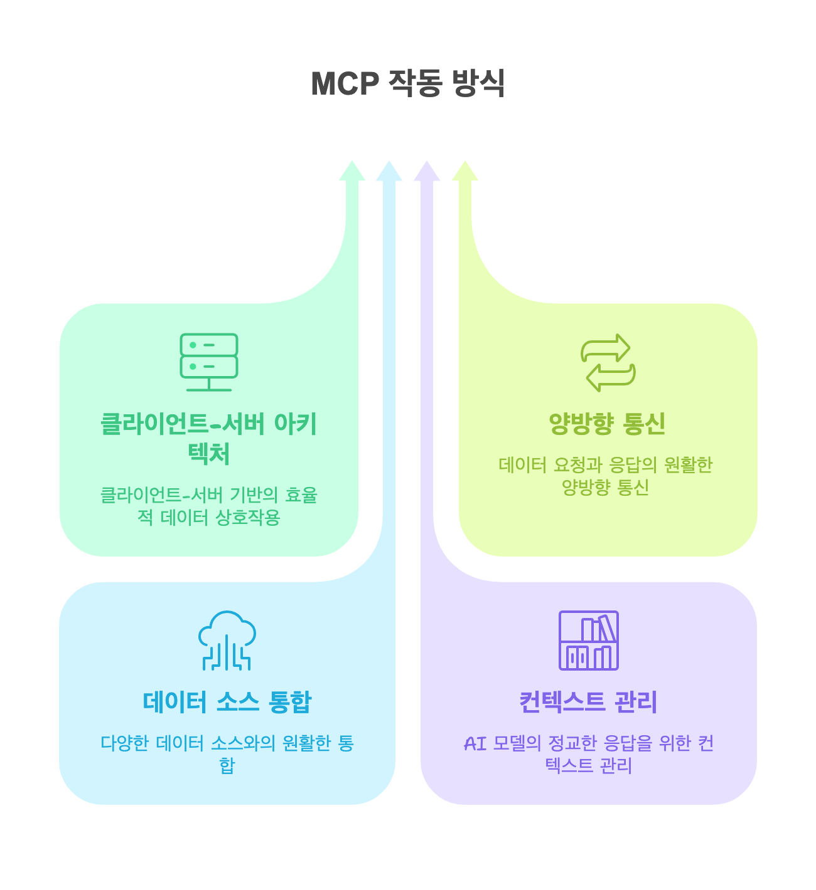
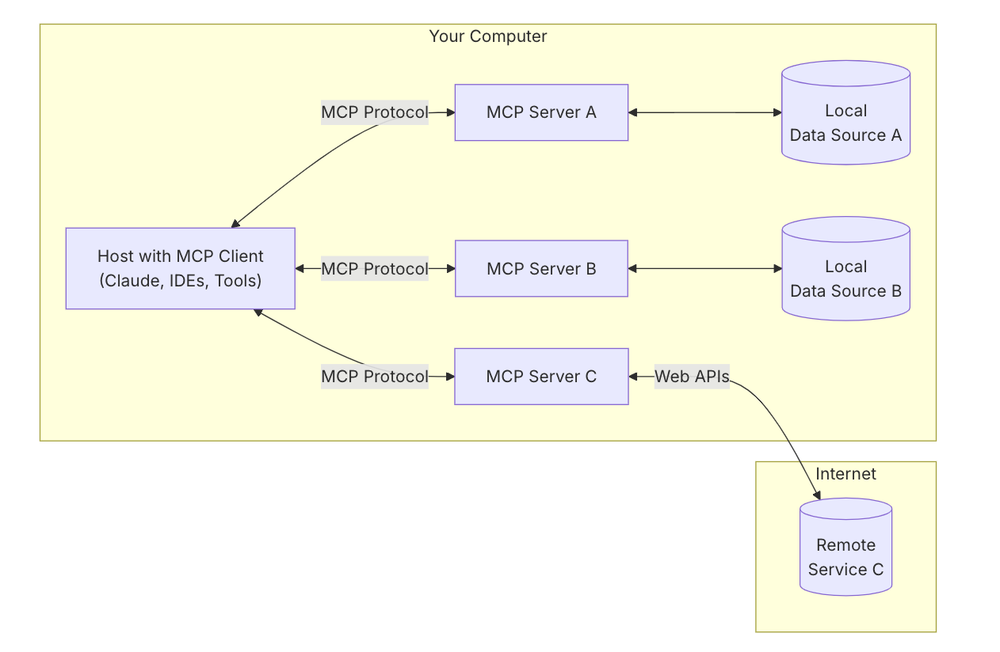
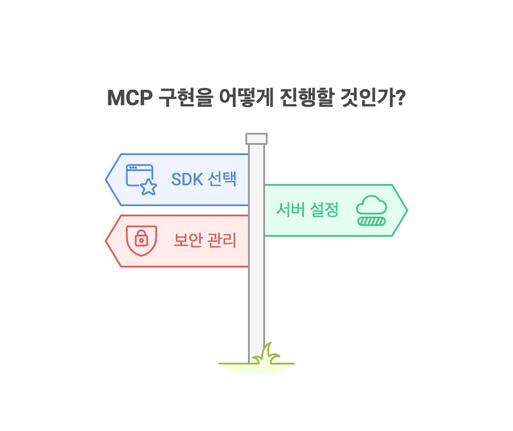

🏠 > [클로드4 (Claude4)](../../) > [MCP](../) > `MCP (Model Context Protocol) 란? LLM 통합의 새로운 표준`

### INDEX

- [MCP (Model Context Protocol)란?](#mcp-model-context-protocol란)
- [MCP의 작동 방식](#mcp의-작동-방식)
- [MCP를 활용한 LLM 통합](#mcp를-활용한-llm-통합)
- [MCP 구현 방법](#mcp-구현-방법)
- [MCP의 미래와 전망](#mcp의-미래와-전망)
- [참고자료](#참고자료) 

---
# MCP (Model Context Protocol) 란? LLM 통합의 새로운 표준

인공지능(AI) 기술이 발전하면서, 대규모 언어 모델(LLM)과 외부 데이터 소스 및 도구를 통합하는 방법이 점점 더 중요해지고 있습니다. **MCP(Model Context Protocol)** 는 이러한 통합을 위한 새로운 표준으로 주목받고 있습니다. 이 글에서는 MCP의 개념, 작동 방식, 구현 방법, 그리고 미래 전망에 대해 자세히 알아보겠습니다.

## MCP (Model Context Protocol)란?
MCP (Model Context Protocol)는 대규모 언어 모델(LLM)과 외부 데이터 소스 및 도구를 연결하기 위한 오픈 프로토콜입니다. USB-C 포트가 다양한 기기를 표준화된 방식으로 연결하는 것처럼, MCP는 AI 모델이 다양한 데이터 소스와 도구에 접근할 수 있도록 표준화된 인터페이스를 제공합니다.

### MCP의 정의와 주요 목적
MCP는 LLM 통합을 간소화하고, 데이터 소스와 AI 모델 간의 상호작용을 표준화하는 데 목적이 있습니다. 이를 통해 AI 모델이 더 나은 컨텍스트를 이해하고, 보다 관련성 높은 응답을 생성할 수 있습니다.

### LLM 통합에서의 MCP의 중요성
기존의 AI 모델은 데이터 소스와의 연결이 제한적이었습니다. MCP는 이러한 문제를 해결하며, 데이터 소스 연결을 통해 AI 모델이 실시간 데이터에 접근하고, 외부 도구를 활용할 수 있도록 지원합니다. 이는 AI 모델의 응답 품질과 유용성을 크게 향상시킵니다.

### MCP가 해결하는 문제점
- **정보 사일로 문제:** MCP는 데이터 소스 간의 단절을 해소하여 AI 모델이 필요한 데이터를 쉽게 접근할 수 있도록 합니다.
- **복잡한 통합 과정:** MCP는 단일 프로토콜을 통해 다양한 데이터 소스와의 통합을 간소화합니다.
- **확장성 부족:** MCP는 오픈 프로토콜로서, 다양한 플랫폼과의 호환성을 제공합니다.

 

[[TOP]](#index)

---
## MCP의 작동 방식
MCP는 클라이언트-서버 아키텍처를 기반으로 작동하며, 데이터 소스와 AI 모델 간의 효율적인 상호작용을 지원합니다.

|  |
|:---:|
| Fig1. MCP 작동 방식 |

### MCP의 기본 원리
MCP는 클라이언트(LLM 애플리케이션)와 서버(데이터 소스 제공자) 간의 양방향 통신을 가능하게 합니다. 이를 통해 AI 모델은 데이터를 요청하고, 서버는 해당 데이터를 제공하거나 작업을 수행합니다. 

|  |
|:---:|
| Fig2. MCP 아키텍처 |

### 데이터 소스 연결과 컨텍스트 관리
MCP는 로컬 데이터 소스(예: 파일 시스템, 데이터베이스)와 원격 서비스(API, 클라우드 도구) 모두를 지원합니다. 이를 통해 AI 모델은 다양한 데이터 소스에서 컨텍스트를 수집하고, 이를 기반으로 보다 정교한 응답을 생성할 수 있습니다.

### LLM과의 상호작용 과정
- **요청 생성:** LLM 애플리케이션이 MCP 서버에 데이터를 요청합니다.
- **데이터 처리:** MCP 서버는 요청을 처리하고, 필요한 데이터를 반환합니다.
- **응답 생성:** LLM은 반환된 데이터를 기반으로 최종 응답을 생성합니다.

 

[[TOP]](#index)

---
## MCP를 활용한 LLM 통합
MCP는 LLM 통합의 핵심 역할을 하며, 이를 통해 AI 개발과 데이터 소스 연결을 더욱 효율적으로 수행할 수 있습니다.

### LLM 통합에서 MCP의 역할
MCP는 LLM이 외부 데이터 소스와 도구를 활용할 수 있도록 지원합니다. 이를 통해 AI 모델은 단순한 텍스트 생성에서 벗어나, 컨텍스트 기반의 고급 작업을 수행할 수 있습니다.

### MCP를 통한 효율적인 AI 개발 사례
예를 들어, 한 기업이 MCP를 활용하여 내부 데이터베이스와 AI 모델을 연결했다고 가정해봅시다. 이를 통해 AI 모델은 실시간으로 데이터베이스를 조회하고, 고객의 질문에 정확한 답변을 제공할 수 있습니다. 이는 고객 서비스의 품질을 크게 향상시킬 수 있습니다.

### MCP를 활용한 데이터 소스 연결 방법
MCP는 사전 구축된 서버와 클라이언트를 제공하여, 개발자가 손쉽게 데이터 소스를 연결할 수 있도록 지원합니다. 예를 들어, Google Drive, Slack, GitHub와 같은 인기 있는 플랫폼에 대한 MCP 서버가 이미 제공되고 있습니다.

 

[[TOP]](#index)

---
## MCP 구현 방법
MCP를 구현하려면 몇 가지 기술적 요구사항과 주의사항을 고려해야 합니다.

|  |
|:---:|
| Fig3. 클로드 MCP 구현 |

### MCP 구현을 위한 기술적 요구사항
- **SDK 사용:** MCP는 Python, TypeScript, Java 등 다양한 언어의 SDK를 제공합니다.
- **서버 설정:** MCP 서버는 로컬 또는 클라우드 환경에서 실행될 수 있습니다.
- **보안 설정:** 데이터 접근 권한과 보안을 철저히 관리해야 합니다.

### 오픈 프로토콜로서의 MCP의 장점
MCP는 오픈 소스 프로젝트로, 누구나 참여하고 기여할 수 있습니다. 이는 개발자 커뮤니티의 협력을 촉진하며, MCP의 기능을 지속적으로 확장할 수 있는 기반을 제공합니다.

### MCP 구현 시 주의할 점
- **데이터 보안:** 민감한 데이터가 외부로 유출되지 않도록 철저한 보안 조치가 필요합니다.
- **성능 최적화:** 대규모 데이터 소스와의 통합 시 성능 저하를 방지하기 위한 최적화가 필요합니다.

 

[[TOP]](#index)

---
## MCP의 미래와 전망
MCP는 AI 개발과 LLM 통합의 새로운 표준으로 자리 잡을 가능성이 높습니다.

### MCP가 AI 개발에 미치는 영향
MCP는 AI 모델이 보다 풍부한 컨텍스트를 활용할 수 있도록 지원하며, 이를 통해 AI 응용 프로그램의 품질과 유용성을 크게 향상시킬 수 있습니다.

### LLM 통합의 새로운 표준으로 자리잡는 이유
MCP는 단일 프로토콜로 다양한 데이터 소스와 도구를 통합할 수 있는 유연성을 제공합니다. 이는 개발자와 기업 모두에게 큰 이점을 제공합니다.

### MCP의 발전 가능성과 향후 응용 분야
MCP는 앞으로도 지속적으로 발전하며, 지식 그래프 관리, 실시간 데이터 분석, 고급 API 통합 등 다양한 분야에서 활용될 수 있을 것입니다.

MCP는 AI와 데이터 소스 간의 통합을 혁신적으로 변화시키는 기술입니다. 이를 통해 AI 모델은 보다 정교하고 유용한 응답을 생성할 수 있으며, 기업은 AI 기술을 활용한 새로운 기회를 창출할 수 있습니다.

 

[[TOP]](#index)

---
## 참고자료

- [Introducing the Model Context Protocol \ Anthropic](https://www.anthropic.com/news/model-context-protocol)
- [Introduction - Model Context Protocol](https://modelcontextprotocol.io/docs/getting-started/intro)
- [Model Context Protocol · GitHub](https://github.com/modelcontextprotocol)
- [Model Context Protocol (MCP) - Anthropic](https://docs.anthropic.com/en/docs/mcp)
- [Model Context Protocol (MCP): Integrating Azure OpenAI for Enhanced Tool Integration and Prompting | Microsoft Community Hub](https://techcommunity.microsoft.com/blog/azure-ai-foundry-blog/model-context-protocol-mcp-integrating-azure-openai-for-enhanced-tool-integratio/4393788)

 

[[TOP]](#index)

---