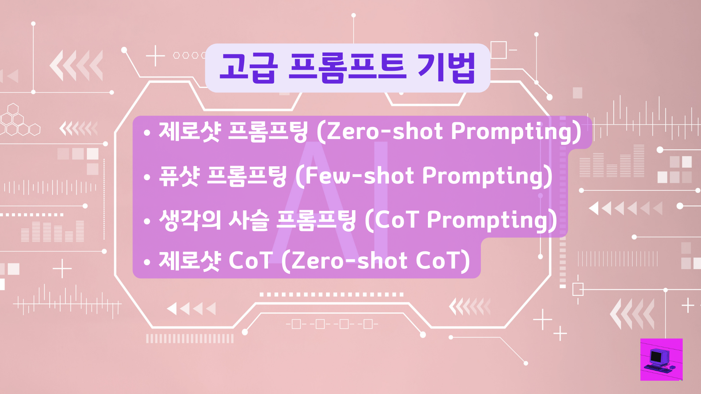

🏠 > [프롬프트 엔지니어링](../) > `언어 모델 최적화를 위한 고급 프롬프트 엔지니어링 가이드`

### INDEX

- [1. 제로샷 프롬프팅 (Zero-shot Prompting)](#1-제로샷-프롬프팅-zero-shot-prompting)
- [2. 퓨샷 프롬프팅 (Few-shot Prompting)](#2-퓨샷-프롬프팅-few-shot-prompting)
- [3. 생각의 사슬 프롬프팅 (Chain-of-Thought Prompting, CoT Prompting)](#3-생각의-사슬-프롬프팅-chain-of-thought-prompting-cot-prompting)
- [4. 제로샷 CoT (Zero-shot CoT)](#4-제로샷-cot-zero-shot-cot)
- [5. 결론](#5-결론)
- [참고자료](#참고자료)

---
# 언어 모델 최적화를 위한 고급 프롬프트 엔지니어링 가이드
이번 시간 에는 ChatGPT로 부터 더 좋은 결과를 얻기 위한 언어 모델 최적화를 위한 고급 프롬프트 엔지니어링 방법에 대한 가이드를 제공합니다. 이 글에서는 제로샷 프롬프팅 부터 Chat Of Thought(CoT) 프롬프트 까지 다양한 주제를 다룹니다. 용어가 생소 할수 있지만 예제를 보시고 이해하시면서 고급 프롬프트를 만들어 보시고 고급 프롬프트 기법을 익혀보시기 바랍니다.

|  |
|:---:|
| Fig1. 고급 프롬프트 엔지니어링 기법 | 

## 1. 제로샷 프롬프팅 (Zero-shot Prompting)
제로샷 프롬프팅은 모델에 예시를 제공하지 않고 작업을 수행하도록 하는 방법입니다. 예를 들어, 텍스트를 중립, 부정, 긍정으로 분류하라는 프롬프트를 제공하면, 모델은 제로샷 능력을 활용하여 출력을 생성합니다.

```shell
🚨 프롬프트
프롬프트: "나는 휴가가 괜찮다고 생각한다." 이 문장은 중립, 부정, 또는 긍정인가요?
```

```shell
🚨 출력
중립
```

<br/>

[[TOP]](#index)

---
## 2. 퓨샷 프롬프팅 (Few-shot Prompting)
제로샷 프롬프팅이 실패할 경우, 프롬프트에 예시를 제공하여 모델의 성능을 향상시키는 방법입니다. 예시는 모델이 응답을 생성하는 데 도움이 되는 조건을 제공합니다.

```shell
🚨 프롬프트
"whatpu"는 탄자니아 원산의 작고 털이 많은 동물입니다. "whatpu"를 사용한 문장 예시는 다음과 같습니다: 우리는 아프리카를 여행하면서 "whatpu"를 처음으로 봤습니다.

"whatpu"는 어떤 동물인가요?
```

```shell
🚨 출력
"whatpu"는 탄자니아 원산의 작고 털이 많은 동물입니다.
```

<br/>

[[TOP]](#index)

---
## 3. 생각의 사슬 프롬프팅 (Chain-of-Thought Prompting, CoT Prompting)
생각의 사슬 프롬프팅은 복잡한 추론 작업을 수행하기 위해 중간 추론 단계를 포함하는 프롬프팅 방법입니다.

언어 모델의 성능을 향상시키는 또 다른 방법은 중간 추론 단계를 포함하는 Chain-of-Thought (CoT) 프롬프팅입니다. 이 기법은 Wei 등에 의해 2022년에 소개되었으며, 응답하기 전에 추론이 필요한 더 복잡한 작업에서 더 나은 결과를 얻기 위해 퓨샷 프롬프팅과 결합할 수 있습니다.

다음은 CoT 프롬프팅을 사용한 예시입니다.

```shell
🚨 CoT 프롬프팅
이 그룹에서 홀수들의 합은 짝수입니다: 4, 8, 9, 15, 12, 2, 1. A: 모든 홀수들(9, 15, 1)을 더하면 25입니다. 답은 False입니다.

이 그룹에서 홀수들의 합은 짝수입니다: 17, 10, 19, 4, 8, 12, 24. A: 모든 홀수들(17, 19)을 더하면 36입니다. 답은 True입니다.

이 그룹에서 홀수들의 합은 짝수입니다: 16, 11, 14, 4, 8, 13, 24. A: 모든 홀수들(11, 13)을 더하면 24입니다. 답은 True입니다.

이 그룹에서 홀수들의 합은 짝수입니다: 17, 9, 10, 12, 13, 4, 2. A: 모든 홀수들(17, 9, 13)을 더하면 39입니다. 답은 False입니다.

이 그룹에서 홀수들의 합은 짝수입니다: 15, 32, 5, 13, 82, 7, 1. A:
```

```shell
🚨 CoT 출력
모든 홀수들(15, 5, 13, 7, 1)을 더하면 41입니다. 답은 False입니다.
```

추론 단계를 제공했을 때 완벽한 결과를 볼 수 있습니다.

다음으로는 더 적은 예시를 제공하여 이 작업을 해결할 수 있습니다. 즉, 하나의 예시만으로도 충분합니다.

```shell
🚨 CoT 프롬프팅
이 그룹에서 홀수들의 합은 짝수입니다: 4, 8, 9, 15, 12, 2, 1. A: 모든 홀수들(9, 15, 1)을 더하면 25입니다. 답은 False입니다.

이 그룹에서 홀수들의 합은짝수입니다: 15, 32, 5, 13, 82, 7, 1. A:
```

```shell
🚨 출력
모든 홀수들(15, 5, 13, 7, 1)을 더하면 41입니다. 답은 False입니다.
```

이 기법은 큰 언어 모델에서 나타나는 새로운 능력이라는 점을 참고 하셔서, 이를 통해 언어 모델의 성능을 향상시키고, 더욱 정확한 결과를 얻을 수 있습니다. 이러한 방법을 활용하여 언어 모델의 성능을 최적화하고, 더욱 효과적인 대화를 생성할 수 있습니다.

<br/>

[[TOP]](#index)

---
## 4. 제로샷 CoT (Zero-shot CoT)
언어 모델의 성능을 향상시키는 방법 중 하나는 Zero-Shot CoT(Chain of Thought)라는 기법을 사용하는 것입니다. 이 기법은 최근에 Kojima 등에 의해 제안되었으며, 기본적으로 원래의 프롬프트에 "Let's think step by step"을 추가하는 것을 포함합니다. 간단한 문제를 통해 모델이 어떻게 작동하는지 살펴봅시다.

기본 프롬프트 사용 먼저, 기본 프롬프트를 사용하여 문제를 제시해 보겠습니다.
```shell
🚨 CoT 프롬프팅
나는 시장에 가서 사과 10개를 샀다. 이웃에게 사과 2개를 주고 수리공에게 2개를 주었다. 그 다음에 사과 5개를 더 사고 1개를 먹었다. 나는 몇 개의 사과를 가지고 있을까?
```

```shell
🚨 출력
11개의 사과
```

답변이 틀렸습니다! 이번에는 Zero-Shot CoT 프롬프트를 사용하여 같은 문제를 제시해 보겠습니다. 제로샷 CoT 프롬프트는 아래와 같이 기존의 프롬프트에 "Let's think step by step"을 추가합니다.

```shell
🚨 CoT 프롬프팅
나는 시장에 가서 사과 10개를 샀다. 이웃에게 사과 2개를 주고 수리공에게 2개를 주었다. 그 다음에 사과 5개를 더 사고 1개를 먹었다. 나는 몇 개의 사과를 가지고 있을까? Let's think step by step
```

```shell
🚨 출력
처음에 당신은 사과 10개를 가지고 있었습니다. 이웃과 수리공에게 각각 사과 2개를 주었으므로, 남은 사과는 6개였습니다. 그 다음에 사과 5개를 더 샀으므로, 이제 사과는 11개가 되었습니다. 마지막으로 사과 1개를 먹었으므로, 남은 사과는 10개입니다.
```

이 간단한 프롬프트로 결과의 정확도와 퀄리티가 좋아진 것을 볼 수있습니다. 이러한 방법을 통해 언어 모델의 성능을 향상시키고, 더욱 정확한 결과를 얻을 수 있습니다.

<br/>

[[TOP]](#index)

---
## 5. 결론
이 글을 통해 고급 프롬프트 엔지니어링 기법과 실제 적용 방법에 대해 알아보았습니다. 이러한 지식을 활용하여 언어 모델의 성능을 최적화하고, 더욱 효과적인 대화를 생성할 수 있는데 도움이 되었으면 좋겠습니다.

<br/>

[[TOP]](#index)

---
## 참고자료
- [출처] https://github.com/dair-ai/Prompt-Engineering-Guide/blob/main/guides/prompts-advanced-usage.md#chain-of-thought-prompting

<br/>

[[TOP]](#index)

---