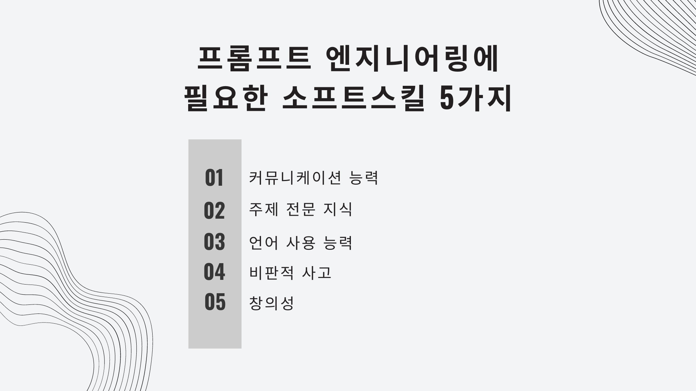

🏠 > [프롬프트 엔지니어링](../) > `프롬프트 엔지니어링이란? AI시대의 새로운 기회`

### INDEX

- [1. 프롬프트 엔지니어링이란?](#1-프롬프트-엔지니어링이란)
- [2. 프롬프트 엔지니어링의 중요성](#2-프롬프트-엔지니어링의-중요성)
- [3. 프롬프트 엔지니어링에 필요한 능력](#3-프롬프트-엔지니어링에-필요한-능력)
- [4. 프롬프트 엔지니어링에 대한 생각](#4-프롬프트-엔지니어링에-대한-생각)
- [참고자료](#참고자료) 

---
# 프롬프트 엔지니어링이란? AI시대의 새로운 기회
AI 시대의 새로운 기회, '프롬프트 엔지니어링'에 대해 들어보셨나요? 기술의 발전은 우리에게 언제나 새로운 직업군을 제시해왔습니다. **AI가 만들어내는 결과물을 좋게 만들기 위해 정확한 동사와 단어를 사용하여 프롬프트를 만드는 기술**, 바로 이것이 프롬프트 엔지니어링의 핵심입니다.

## 1. 프롬프트 엔지니어링이란?
프롬프트 엔지니어링은 인공지능(AI)이 생성하는 결과물의 질을 높이기 위해, **AI에게 제공하는 지시사항인 '프롬프트'를 정교하게 설계하는 과정**입니다. AI의 의사결정 과정에 영향을 미치는 이러한 **지시사항은 정확한 어휘 선택과 문맥 이해를 필요**로 합니다. 프롬프트 엔지니어는 AI가 어떻게 작동하는지에 대한 깊은 이해를 바탕으로, AI가 인간의 의도에 부합하게 행동하도록 유도하는 역할을 합니다. 이는 AI가 단순한 명령 수행을 넘어, 더욱 인간적인 상호작용을 할 수 있게 만드는 중요한 역할을 수행합니다.

 

[[TOP]](#index)

---
## 2. 프롬프트 엔지니어링의 중요성
AI 기술이 급속하게 발전함에 따라, 프롬프트 엔지니어링은 AI의 한계를 보완하고 그 가능성을 극대화하는 데 있어 핵심적인 요소로 자리매김하고 있습니다. 특히 AI 챗봇과 같은 대화형 AI에서는 문법적 정확성뿐만 아니라 사용자의 의도를 정확히 파악하고 적절한 반응을 제시하는 것이 중요합니다. 이러한 과제를 수행하기 위해 프롬프트 엔지니어는 AI의 '언어적 이해력'을 향상시키는 데 집중하고 있으며, 이는 AI의 사용성과 만족도를 높이는 데 기여하고 있습니다.

### 2.1. 기술적 배경이 필요 없는 이유
프롬프트 엔지니어링은 전통적인 컴퓨터 과학이나 프로그래밍 기술만을 요구하지 않습니다. AI와의 상호작용이 중심이 되면서, 인문학적 소양과 언어적 민감성이 더욱 중요해지고 있습니다. 이는 기술적 배경이 없는 사람들에게도 문이 열려 있음을 의미하며, 다양한 배경을 가진 사람들이 이 분야에 진입할 수 있는 기회를 제공합니다.

최근 노코드(No-Code) 플랫폼의 등장은 프로그래밍 기술 없이도 AI와 상호작용할 수 있는 환경을 조성하고 있습니다. 이러한 환경은 프롬프트 엔지니어링을 더욱 접근하기 쉽게 만들며, 비기술적 사용자들도 AI를 통해 창의적인 솔루션을 구현할 수 있도록 돕고 있습니다. Andrej Karpathy가 2023년 1월에 언급한 바와 같이, "가장 인기 있는 새 프로그래밍 언어는 영어"라는 말은 이 분야의 접근성과 중요성을 강조합니다. [[트위터 원문 보기]](https://x.com/karpathy/status/1617979122625712128)

|  |
|:---:|
| Fig1. 프롬프트 엔지니어링을 위한 영어의 중요성 - The hottest new programming language is English |

프롬프트 엔지니어링은 **특별한 분야의 전문가들에게만 국한되지 않는 넓은 범위의 역량을 필요**로 합니다. 이는 기술적인 사람들뿐만 아니라, 창의적인 사람들이 보다 다양한 기술 세트를 가지고 생성적 AI 개발의 특정 측면에 참여할 수 있게 하는 기회를 열고 있으며, 이는 주로 노코드 혁신과 관련되어 있습니다.

일부 조직들이 몇 년 간의 엔지니어링, 개발, 혹은 코딩 경험을 가진 프롬프트 엔지니어를 구인하고 있음에도 불구하고, 강력한 엔지니어링 배경이 이 역할에 대한 필수 요건은 아닙니다. 이는 프롬프트 엔지니어링이 다양한 배경과 기술을 가진 사람들에게 열려 있는 분야임을 잘 보여주며, 창의성과 비판적 사고력, 그리고 커뮤니케이션 능력이 중요한 역량으로 강조되고 있습니다.

### 2.2. 노코드 혁신과 프롬프트 엔지니어링
최근 노코드(No-Code) 플랫폼의 등장은 프로그래밍 기술 없이도 AI와 상호작용할 수 있는 환경을 조성하고 있습니다. 이러한 환경은 프롬프트 엔지니어링을 더욱 접근하기 쉽게 만들며, 비기술적 사용자들도 AI를 통해 창의적인 솔루션을 구현할 수 있도록 돕고 있습니다.

 

[[TOP]](#index)

---
## 3. 프롬프트 엔지니어링에 필요한 능력
프롬프트 엔지니어링을 위해서는 다양한 능력이 필요합니다. 이는 AI와의 효과적인 커뮤니케이션뿐만 아니라, 복잡한 문제를 해결하고 창의적인 아이디어를 구현할 수 있는 능력을 포함합니다.

|  |
|:---:|
| Fig2. 프롬프트 엔지니어링에 필요한 능력 |

### 3.1. 커뮤니케이션 능력
명확하고 효과적인 지시를 제공할 수 있는 커뮤니케이션 능력은 프롬프트 엔지니어링의 기본입니다. AI에게 정확한 지시를 내리기 위해서는 명료한 표현과 논리적인 구성이 필수적입니다.

### 3.2. 주제 전문 지식
특정 분야에 대한 깊은 이해와 전문 지식은 AI를 해당 분야에 맞게 조정하는 데 필수적입니다. 이를 통해 AI가 더욱 정확하고 유용한 정보를 제공할 수 있게 됩니다.

### 3.3. 언어 사용 능력
AI와의 상호작용에서 언어는 가장 중요한 도구입니다. 의도를 명확하게 전달하기 위해 **적절한 동사, 어휘, 시제를 사용**하는 능력은 프롬프트 엔지니어링에서 중요한 역할을 합니다. 또한 AI가 영어를 사용 하였을 때 더 정확하게 동작 하기 때문에 프롬프트를 작성 할수 있는 영어 능력이 더 중요 해졌습니다.

### 3.4. 비판적 사고
AI가 잘못된 정보를 생성할 가능성을 염두에 두고, 이를 파악하고 교정할 수 있는 비판적 사고력은 프롬프트 엔지니어링에서 중요합니다. 이는 AI의 오류를 최소화하고 신뢰성을 높이는 데 기여합니다.

### 3.5. 창의성
새로운 프롬프트를 시도하고, 그 결과에 따라 지시사항을 조정하는 창의적인 접근 방식은 AI와의 상호작용을 더욱 풍부하고 다채롭게 만듭니다. 창의성은 프롬프트 엔지니어링의 혁신적인 발전을 이끄는 원동력입니다.

 

[[TOP]](#index)

---
## 4. 프롬프트 엔지니어링에 대한 생각
프롬프트 엔지니어링은 단순한 기술이 아닌, *AI와 인간이 조화롭게 상호작용*하는 미래를 위한 중요한 다리입니다. 이 분야에서 성공하기 위해선 커뮤니케이션, 주제 전문 지식, 언어 사용 능력, 비판적 사고, 그리고 창의성과 같은 다양한 역량을 갖추어야 합니다. 여러분도 AI 시대의 새로운 기회를 잡고 싶다면, 관련 지식을 쌓고, 다양한 AI 플랫폼을 실험해보며 경험을 쌓아가는 것이 좋습니다. AI와 함께 성장하며, 프롬프트 엔지니어링의 세계에서 여러분만의 독특한 가치를 창출해 나가길 응원합니다!

 

[[TOP]](#index)

---
## 참고자료
- [What is prompt engineering? Definition + skills | Zapier](https://zapier.com/blog/prompt-engineering/)

 

[[TOP]](#index)

---